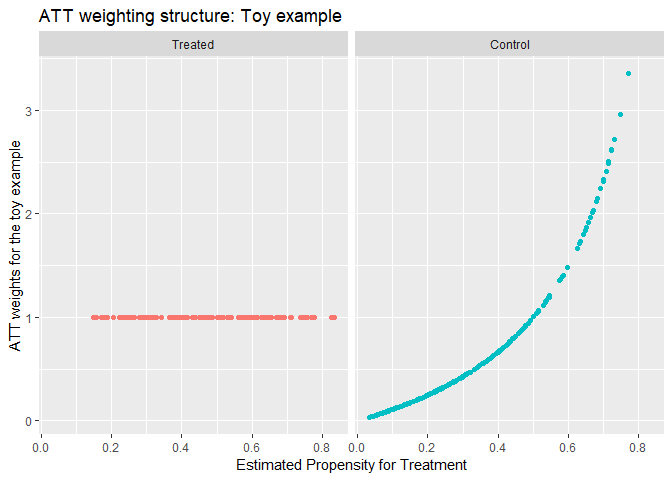

The toy example: A Worked Analysis
================
Thomas E. Love, Ph.D.
Version: 2019-02-03

-   [Setup](#setup)
-   [The Data Set](#the-data-set)
-   [The Codebook for the `toy` data](#the-codebook-for-the-toy-data)
-   ["Skimmed" Summaries, within treatment groups](#skimmed-summaries-within-treatment-groups)
-   [Table 1](#table-1)
-   [Data Management and Cleanup](#data-management-and-cleanup)
    -   [Range Checks for Quantitative (continuous) Variables](#range-checks-for-quantitative-continuous-variables)
    -   [Restating Categorical Information in Helpful Ways](#restating-categorical-information-in-helpful-ways)
        -   [Re-expressing Binary Variables as Numbers and Factors](#re-expressing-binary-variables-as-numbers-and-factors)
        -   [Testing Your Code - Sanity Checks](#testing-your-code---sanity-checks)
    -   [Dealing with Variables including More than Two Categories](#dealing-with-variables-including-more-than-two-categories)
        -   [Preparing Indicator Variables for `covF`](#preparing-indicator-variables-for-covf)
    -   [Creating the Transformation and Product Terms](#creating-the-transformation-and-product-terms)
-   [Data Set After Cleaning](#data-set-after-cleaning)
    -   [Skim, within Treatment Groups](#skim-within-treatment-groups)
    -   [Table 1](#table-1-1)
-   [The 13 Tasks We'll Tackle in this Example](#the-13-tasks-well-tackle-in-this-example)
-   [Task 1. Ignoring covariates, estimate the effect of treatment vs. control on...](#task-1.-ignoring-covariates-estimate-the-effect-of-treatment-vs.-control-on...)
    -   [Outcome 1 (a continuous outcome)](#outcome-1-a-continuous-outcome)
    -   [Outcome 2 (a binary outcome)](#outcome-2-a-binary-outcome)
        -   [Using a 2x2 table in standard epidemiological format](#using-a-2x2-table-in-standard-epidemiological-format)
        -   [Using a logistic regression model](#using-a-logistic-regression-model)
    -   [Outcome 3 (a time-to-event outcome with right censoring)](#outcome-3-a-time-to-event-outcome-with-right-censoring)
    -   [Unadjusted Estimates of Treatment Effect on Outcomes](#unadjusted-estimates-of-treatment-effect-on-outcomes)
-   [Task 2. Fit the propensity score model, then plot the PS-treatment relationship](#task-2.-fit-the-propensity-score-model-then-plot-the-ps-treatment-relationship)
    -   [Comparing the Distribution of Propensity Score Across the Two Treatment Groups](#comparing-the-distribution-of-propensity-score-across-the-two-treatment-groups)
-   [Task 3. Rubin's Rules to Check Overlap Before Propensity Adjustment](#task-3.-rubins-rules-to-check-overlap-before-propensity-adjustment)
    -   [Rubin's Rule 1](#rubins-rule-1)
    -   [Rubin's Rule 2](#rubins-rule-2)
    -   [Rubin's Rule 3](#rubins-rule-3)
        -   [A Cleveland Dot Chart of the Rubin's Rule 3 Results](#a-cleveland-dot-chart-of-the-rubins-rule-3-results)
-   [Task 4. Use 1:1 greedy matching on the linear PS, then check post-match balance](#task-4.-use-11-greedy-matching-on-the-linear-ps-then-check-post-match-balance)
    -   [Balance Assessment (Semi-Automated)](#balance-assessment-semi-automated)
    -   [Extracting, Tabulating Standardized Differences (without `cobalt`)](#extracting-tabulating-standardized-differences-without-cobalt)
    -   [A Love Plot describing Standardized Differences Before/After Matching (without `cobalt`)](#a-love-plot-describing-standardized-differences-beforeafter-matching-without-cobalt)
    -   [Using `cobalt` to build a "Love Plot" after Matching](#using-cobalt-to-build-a-love-plot-after-matching)
        -   [Building a Plot of Standardized Differences, with `cobalt`](#building-a-plot-of-standardized-differences-with-cobalt)
        -   [Building a Plot of Variance Ratios, with `cobalt`](#building-a-plot-of-variance-ratios-with-cobalt)
    -   [Extracting, Tabulating Variance Ratios (without `cobalt`)](#extracting-tabulating-variance-ratios-without-cobalt)
    -   [Creating a New Data Frame, Containing the Matched Sample (without `cobalt`)](#creating-a-new-data-frame-containing-the-matched-sample-without-cobalt)
    -   [Rubin's Rules to Check Balance After Matching](#rubins-rules-to-check-balance-after-matching)
        -   [Rubin's Rule 1](#rubins-rule-1-1)
        -   [Rubin's Rule 2](#rubins-rule-2-1)
        -   [Rubin's Rule 3](#rubins-rule-3-1)
        -   [A Cleveland Dot Chart of the Rubin's Rule 3 Results Pre vs. Post-Match](#a-cleveland-dot-chart-of-the-rubins-rule-3-results-pre-vs.-post-match)
-   [Task 5. After matching, estimate the causal effect of treatment on ...](#task-5.-after-matching-estimate-the-causal-effect-of-treatment-on-...)
    -   [Outcome 1 (a continuous outcome)](#outcome-1-a-continuous-outcome-1)
        -   [Approach 1. Automated Approach from the Matching package - ATT Estimate](#approach-1.-automated-approach-from-the-matching-package---att-estimate)
        -   [Approach 2. Automated Approach from the Matching package - ATE Estimate](#approach-2.-automated-approach-from-the-matching-package---ate-estimate)
        -   [ATT vs. ATE: Definitions](#att-vs.-ate-definitions)
        -   [Approach 3. Mirroring the Paired T test in a Regression Model](#approach-3.-mirroring-the-paired-t-test-in-a-regression-model)
        -   [Approach 4. A Mixed Model to account for 1:1 Matching](#approach-4.-a-mixed-model-to-account-for-11-matching)
        -   [Practically, does any of this matter in this example?](#practically-does-any-of-this-matter-in-this-example)
    -   [Outcome 2 (a binary outcome)](#outcome-2-a-binary-outcome-1)
        -   [Approach 1. Automated Approach from the Matching package (ATT)](#approach-1.-automated-approach-from-the-matching-package-att)
        -   [Approach 2. Using the matched sample to perform a conditional logistic regression](#approach-2.-using-the-matched-sample-to-perform-a-conditional-logistic-regression)
    -   [Outcome 3 (a time-to-event outcome)](#outcome-3-a-time-to-event-outcome)
        -   [Approach 1. Automated Approach from the Matching package](#approach-1.-automated-approach-from-the-matching-package)
        -   [Approach 2. A stratified Cox proportional hazards model](#approach-2.-a-stratified-cox-proportional-hazards-model)
    -   [Results So Far (After Propensity Matching)](#results-so-far-after-propensity-matching)
-   [Task 6. Subclassify by PS quintile, then display post-subclassification balance](#task-6.-subclassify-by-ps-quintile-then-display-post-subclassification-balance)
    -   [Check Balance and Propensity Score Overlap in Each Quintile](#check-balance-and-propensity-score-overlap-in-each-quintile)
    -   [Creating a Standardized Difference Calculation Function](#creating-a-standardized-difference-calculation-function)
    -   [Creating the Five Subsamples, by PS Quintile](#creating-the-five-subsamples-by-ps-quintile)
    -   [Standardized Differences in Each Quintile, and Overall](#standardized-differences-in-each-quintile-and-overall)
    -   [Plotting the Standardized Differences](#plotting-the-standardized-differences)
    -   [Checking Rubin's Rules Post-Subclassification](#checking-rubins-rules-post-subclassification)
        -   [Rubin's Rule 1](#rubins-rule-1-2)
        -   [Rubin's Rule 2](#rubins-rule-2-2)
        -   [Rubin's Rule 3](#rubins-rule-3-2)
-   [Task 7. After subclassifying, what is the estimated average treatment effect?](#task-7.-after-subclassifying-what-is-the-estimated-average-treatment-effect)
    -   [... on Outcome 1 \[a continuous outcome\]](#on-outcome-1-a-continuous-outcome)
    -   [... on Outcome 2 \[a binary outcome\]](#on-outcome-2-a-binary-outcome)
    -   [... on Outcome 3 \[a time to event\]](#on-outcome-3-a-time-to-event)
        -   [Checking the Proportional Hazards Assumption](#checking-the-proportional-hazards-assumption)
    -   [Results So Far (After Matching and Subclassification)](#results-so-far-after-matching-and-subclassification)
-   [Task 8. Execute weighting by the inverse PS, then assess covariate balance](#task-8.-execute-weighting-by-the-inverse-ps-then-assess-covariate-balance)
    -   [ATT approach: Weight treated subjects as 1; control subjects as ps/(1-ps)](#att-approach-weight-treated-subjects-as-1-control-subjects-as-ps1-ps)
    -   [ATE Approach: Weight treated subjects by 1/ps; Control subjects by 1/(1-PS)](#ate-approach-weight-treated-subjects-by-1ps-control-subjects-by-11-ps)
    -   [Assessing Balance after Weighting](#assessing-balance-after-weighting)
        -   [Reminder of ATT vs. ATE Definitions](#reminder-of-att-vs.-ate-definitions)
        -   [For ATT weights (`wts1`)](#for-att-weights-wts1)
        -   [For ATE weights (`wts2`)](#for-ate-weights-wts2)
    -   [Rubin's Rules after ATT weighting](#rubins-rules-after-att-weighting)
        -   [Rubin's Rule 1](#rubins-rule-1-3)
        -   [Rubin's Rule 2](#rubins-rule-2-3)
        -   [Rubin's Rule 3](#rubins-rule-3-3)
    -   [Rubin's Rules after ATE weighting](#rubins-rules-after-ate-weighting)
        -   [Rubin's Rule 1](#rubins-rule-1-4)
        -   [Rubin's Rule 2](#rubins-rule-2-4)
        -   [Rubin's Rule 3](#rubins-rule-3-4)
-   [Using TWANG for Alternative PS Estimation and ATT Weighting](#using-twang-for-alternative-ps-estimation-and-att-weighting)
    -   [Estimate the Propensity Score using Generalized Boosted Regression, and then perfom ATT Weighting](#estimate-the-propensity-score-using-generalized-boosted-regression-and-then-perfom-att-weighting)
        -   [Did we let the simulations run long enough to stabilize estimates?](#did-we-let-the-simulations-run-long-enough-to-stabilize-estimates)
        -   [What is the effective sample size of our weighted results?](#what-is-the-effective-sample-size-of-our-weighted-results)
        -   [How is the balance?](#how-is-the-balance)
        -   [Assessing Balance with `cobalt`](#assessing-balance-with-cobalt)
    -   [Semi-Automated Love plot of Standardized Differences](#semi-automated-love-plot-of-standardized-differences)
    -   [Semi-Automated Love plot of Variance Ratios](#semi-automated-love-plot-of-variance-ratios)
-   [Task 9. After weighting, what is the estimated average causal effect of treatment?](#task-9.-after-weighting-what-is-the-estimated-average-causal-effect-of-treatment)
    -   [... on Outcome 1 \[a continuous outcome\]](#on-outcome-1-a-continuous-outcome-1)
        -   [with ATT weights](#with-att-weights)
        -   [with ATE weights](#with-ate-weights)
        -   [with TWANG ATT weights](#with-twang-att-weights)
    -   [... on Outcome 2 \[a binary outcome\]](#on-outcome-2-a-binary-outcome-1)
        -   [Using ATT weights](#using-att-weights)
        -   [Using ATE weights](#using-ate-weights)
        -   [with TWANG ATT weights](#with-twang-att-weights-1)
    -   [... on Outcome 3 \[a time to event\]](#on-outcome-3-a-time-to-event-1)
        -   [Using ATT weights](#using-att-weights-1)
        -   [Using ATE weights](#using-ate-weights-1)
        -   [with TWANG ATT weights](#with-twang-att-weights-2)
    -   [Results So Far (After Matching, Subclassification and Weighting)](#results-so-far-after-matching-subclassification-and-weighting)
-   [Task 10. After direct adjustment for the linear PS, what is the estimated average causal treatment effect?](#task-10.-after-direct-adjustment-for-the-linear-ps-what-is-the-estimated-average-causal-treatment-effect)
    -   [... on Outcome 1 \[a continuous outcome\]](#on-outcome-1-a-continuous-outcome-2)
    -   [... on Outcome 2 \[a binary outcome\]](#on-outcome-2-a-binary-outcome-2)
    -   [... on Outcome 3 \[a time-to-event outcome\]](#on-outcome-3-a-time-to-event-outcome)
        -   [Check proportional hazards assumption](#check-proportional-hazards-assumption)
    -   [Results So Far (After Matching, Subclassification, Weighting, Adjustment)](#results-so-far-after-matching-subclassification-weighting-adjustment)
-   [Task 11. "Double Robust" Approach - Weighting + Adjustment, what is the estimated average causal effect of treatment?](#task-11.-double-robust-approach---weighting-adjustment-what-is-the-estimated-average-causal-effect-of-treatment)
    -   [... on Outcome 1 \[a continuous outcome\]](#on-outcome-1-a-continuous-outcome-3)
        -   [with ATT weights](#with-att-weights-1)
        -   [with ATE weights](#with-ate-weights-1)
        -   [with `twang` based ATT weights](#with-twang-based-att-weights)
    -   [... on Outcome 2 \[a binary outcome\]](#on-outcome-2-a-binary-outcome-3)
        -   [Using ATT weights](#using-att-weights-2)
        -   [Using ATE weights](#using-ate-weights-2)
        -   [Using `twang` ATT weights](#using-twang-att-weights)
    -   [... on Outcome 3 \[a time to event\]](#on-outcome-3-a-time-to-event-2)
        -   [Using ATT weights](#using-att-weights-3)
        -   [Using ATE weights](#using-ate-weights-3)
        -   [Using `twang` ATT weights](#using-twang-att-weights-1)
-   [Task 12. Results](#task-12.-results)
    -   [Treatment Effect Estimates](#treatment-effect-estimates)
    -   [Quality of Balance: Standardized Differences and Variance Ratios](#quality-of-balance-standardized-differences-and-variance-ratios)
    -   [Quality of Balance: Rubin's Rules](#quality-of-balance-rubins-rules)
-   [What is a Sensitivity Analysis for Matched Samples?](#what-is-a-sensitivity-analysis-for-matched-samples)
    -   [Goal of a Formal Sensitivity Analysis for Matched Samples](#goal-of-a-formal-sensitivity-analysis-for-matched-samples)
    -   [The Sensitivity Parameter, *Γ*](#the-sensitivity-parameter-gamma)
    -   [Interpreting the Sensitivity Parameter, *Γ*](#interpreting-the-sensitivity-parameter-gamma)
-   [Task 13. Sensitivity Analysis for Matched Samples, Outcome 1, using `rbounds`](#task-13.-sensitivity-analysis-for-matched-samples-outcome-1-using-rbounds)
    -   [Rosenbaum Bounds for the Wilcoxon Signed Rank test (Quantitative outcome)](#rosenbaum-bounds-for-the-wilcoxon-signed-rank-test-quantitative-outcome)
    -   [Specifying The Threshold *Γ* value](#specifying-the-threshold-gamma-value)
    -   [Interpreting *Γ* appropriately](#interpreting-gamma-appropriately)
    -   [Alternative Descriptions of *Γ*](#alternative-descriptions-of-gamma)
    -   [An Alternate Approach - the Hodges-Lehman estimate](#an-alternate-approach---the-hodges-lehman-estimate)
    -   [What about other types of outcomes?](#what-about-other-types-of-outcomes)
    -   [What about when we match 1:2 or 1:3 instead of 1:1?](#what-about-when-we-match-12-or-13-instead-of-11)
-   [Wrapup](#wrapup)

Setup
-----

``` r
library(skimr)
library(tableone)
library(broom)
library(Epi)
library(survival)
library(Matching)
library(cobalt)
library(lme4)
library(twang)
library(survey)
library(rbounds)
library(tidyverse)

skim_with(numeric = list(hist = NULL), 
          integer = list(hist = NULL))  

decim <- function(x, k) format(round(x, k), nsmall=k)
```

The Data Set
------------

The Data Set is 100% fictional, and is available as `toy2019.csv` on the course website.

-   It contains data on 400 subjects (140 treated and 260 controls) on treatment status, six covariates, and three outcomes, with no missing observations anywhere.
-   We assume that a logical argument suggests that the square of `covA`, as well as the interactions of `covB` with `covC` and with `covD` should be related to treatment assignment, and thus should be included in our propensity model.
-   Our objective is to estimate the average causal effect of treatment (as compared to control) on each of the three outcomes, without propensity adjustment, and then with propensity matching, subclassification, weighting and regression adjustment using the propensity score.

``` r
toy <- read.csv("toy2019.csv") %>% tbl_df

toy
```

    # A tibble: 400 x 11
       subject treated  covA  covB  covC  covD  covE covF  out1.cost out2.event
       <fct>     <int> <dbl> <int> <dbl> <dbl> <int> <fct>     <int> <fct>     
     1 T_001         0  4.13     0 10      8.2    14 2-Mi~        34 No        
     2 T_002         1  4.58     1  8.69  10.1    13 1-Low        63 No        
     3 T_003         0  1.28     0 11.8    5.6    14 1-Low        61 No        
     4 T_004         0  3.11     0 10.9   10.9    10 1-Low        34 No        
     5 T_005         1  3.31     0 10.5    9      14 3-Hi~        38 No        
     6 T_006         0  4.08     0 13.9   10       5 3-Hi~        51 No        
     7 T_007         0  3.86     1 13      6.1    10 3-Hi~        53 Yes       
     8 T_008         0  2.58     0 12.6    5.2     4 2-Mi~        53 Yes       
     9 T_009         0  3.46     0 10.1    8.8    10 1-Low        61 Yes       
    10 T_010         0  3.11     1 13.3    4.8    10 1-Low        28 No        
    # ... with 390 more rows, and 1 more variable: out3.time <int>

The Codebook for the `toy` data
-------------------------------

``` r
toy.codebook <- data_frame(
    Variable = dput(names(toy)),
    Type = c("Subject ID", "2-level categorical (0/1)", "Quantitative (2 decimal places)",
                         "2-level categorical (0/1)", "Quantitative (1 decimal place)",
                         "Quantitative (1 decimal place)", "Integer",
                         "3-level ordinal factor", "Quantitative outcome",
                         "Binary outcome (did event occur?)", "Time to event outcome"),
    Notes = c("labels are T_001 to T_400", "0 = control, 1 = treated", 
              "reasonable values range from 0 to 6", "0 = no, 1 = yes",
              "plausible range 3-20", "plausible range 3-20", "plausible range 3-20", 
              "1 = Low, 2 = Middle, 3 = High",
              "typical values 10-100", "Yes/No (note: event is bad)", 
              "Time before event is observed or subject exits study (censored), range is 76-154 weeks"))
```

    c("subject", "treated", "covA", "covB", "covC", "covD", "covE", 
    "covF", "out1.cost", "out2.event", "out3.time")

``` r
toy.codebook
```

    # A tibble: 11 x 3
       Variable   Type                 Notes                                   
       <chr>      <chr>                <chr>                                   
     1 subject    Subject ID           labels are T_001 to T_400               
     2 treated    2-level categorical~ 0 = control, 1 = treated                
     3 covA       Quantitative (2 dec~ reasonable values range from 0 to 6     
     4 covB       2-level categorical~ 0 = no, 1 = yes                         
     5 covC       Quantitative (1 dec~ plausible range 3-20                    
     6 covD       Quantitative (1 dec~ plausible range 3-20                    
     7 covE       Integer              plausible range 3-20                    
     8 covF       3-level ordinal fac~ 1 = Low, 2 = Middle, 3 = High           
     9 out1.cost  Quantitative outcome typical values 10-100                   
    10 out2.event Binary outcome (did~ Yes/No (note: event is bad)             
    11 out3.time  Time to event outco~ Time before event is observed or subjec~

With regard to the `out3.time` variable, subjects with `out2.event` = No were censored, so that `out2.event` = Yes indicates an observed event.

"Skimmed" Summaries, within treatment groups
--------------------------------------------

``` r
toy %>% group_by(treated) %>% skim(-subject)
```

    Skim summary statistics
     n obs: 400 
     n variables: 11 
     group variables: treated 

    -- Variable type:factor -------------------------------------------------------------------------------------
     treated   variable missing complete   n n_unique
           0       covF       0      260 260        3
           0 out2.event       0      260 260        2
           1       covF       0      140 140        3
           1 out2.event       0      140 140        2
                            top_counts ordered
     1-L: 118, 2-M: 98, 3-H: 44, NA: 0   FALSE
              No: 154, Yes: 106, NA: 0   FALSE
      2-M: 54, 3-H: 48, 1-L: 38, NA: 0   FALSE
                Yes: 82, No: 58, NA: 0   FALSE

    -- Variable type:integer ------------------------------------------------------------------------------------
     treated  variable missing complete   n   mean    sd p0 p25   p50    p75
           0      covB       0      260 260   0.3   0.46  0   0   0     1   
           0      covE       0      260 260  11.3   3.42  4   9  11    13.25
           0 out1.cost       0      260 260  47.01 12.39 20  38  47    54   
           0 out3.time       0      260 260 109.85 12.61 79 101 110   118.25
           1      covB       0      140 140   0.51  0.5   0   0   1     1   
           1      covE       0      140 140   9.77  2.84  4   8   9    12   
           1 out1.cost       0      140 140  56.64 16.56 20  45  56.5  72.25
           1 out3.time       0      140 140 102.71 11.99 76  95 101   110   
     p100
        1
       19
       84
      154
        1
       16
       84
      136

    -- Variable type:numeric ------------------------------------------------------------------------------------
     treated variable missing complete   n  mean   sd   p0  p25   p50   p75
           0     covA       0      260 260  3    1.09 0.2  2.51  3.08  3.84
           0     covC       0      260 260 10.6  2.05 5.56 9.24 10.6  12.33
           0     covD       0      260 260  8.65 2.21 2.8  7.2   9.05 10.3 
           1     covA       0      140 140  3.16 1.14 0.65 2.45  3.29  4.16
           1     covC       0      140 140  9.62 1.87 5.96 8.17  9.58 10.8 
           1     covD       0      140 140  9.16 2.08 3.2  7.65  9.35 10.8 
      p100
      5.35
     14.44
     12.8 
      5.05
     13.94
     14.5 

Table 1
-------

``` r
factorlist <- c("covB", "covF", "out2.event")

CreateTableOne(data = toy,
    vars = dput(names(select(toy, -subject, -treated))), 
    strata = "treated", factorVars = factorlist)
```

    c("covA", "covB", "covC", "covD", "covE", "covF", "out1.cost", 
    "out2.event", "out3.time")

                           Stratified by treated
                            0              1              p      test
      n                        260            140                    
      covA (mean (sd))        3.00 (1.09)    3.16 (1.14)   0.170     
      covB = 1 (%)              77 (29.6)      72 (51.4)  <0.001     
      covC (mean (sd))       10.60 (2.05)    9.62 (1.87)  <0.001     
      covD (mean (sd))        8.65 (2.21)    9.16 (2.08)   0.025     
      covE (mean (sd))       11.30 (3.42)    9.77 (2.84)  <0.001     
      covF (%)                                            <0.001     
         1-Low                 118 (45.4)      38 (27.1)             
         2-Middle               98 (37.7)      54 (38.6)             
         3-High                 44 (16.9)      48 (34.3)             
      out1.cost (mean (sd))  47.01 (12.39)  56.64 (16.56) <0.001     
      out2.event = Yes (%)     106 (40.8)      82 (58.6)   0.001     
      out3.time (mean (sd)) 109.85 (12.61) 102.71 (11.99) <0.001     

Data Management and Cleanup
===========================

Range Checks for Quantitative (continuous) Variables
----------------------------------------------------

Checking and cleaning the quantitative variables is pretty straightforward - the main thing I'll do at this stage is check the ranges of values shown to ensure that they match up with what I'm expecting. Here, all of the quantitative variables have values that fall within the "permissible" range described by my codebook, so we'll assume that for the moment, we're OK on `subject` (just a meaningless code, really), `covA`, `covC`, `covD`, `covE`, `out1.cost` and `out3.time`, and we see no missingness.

Restating Categorical Information in Helpful Ways
-------------------------------------------------

The cleanup of the toy data focuses, as it usually does, on variables that contain **categories** of information, rather than simple counts or measures, represented in quantitative variables.

### Re-expressing Binary Variables as Numbers and Factors

We have three binary variables (`treated`, `covB` and `out2.event`). A major issue in developing these variables is to ensure that the direction of resulting odds ratios and risk differences are consistent and that cross-tabulations are in standard epidemiological format.

It will be useful to define binary variables in two ways:

-   as a numeric indicator variable taking on the values 0 (meaning "not having the characteristic being studied") or 1 (meaning "having the characteristic being studied")
-   as a text factor - with the levels of our key exposure and outcomes arranged so that "having the characteristic" precedes "not having the characteristic" in R when you create a table, but the covariates should still be No/Yes.

So what do we currently have? From the output below, it looks like `treated` and `covB` are numeric, 0/1 variables, while `out2.event` is a factor with levels "No" and then "Yes"

``` r
toy %>% select(treated, covB, out2.event) %>% summary()
```

        treated          covB        out2.event
     Min.   :0.00   Min.   :0.0000   No :212   
     1st Qu.:0.00   1st Qu.:0.0000   Yes:188   
     Median :0.00   Median :0.0000             
     Mean   :0.35   Mean   :0.3725             
     3rd Qu.:1.00   3rd Qu.:1.0000             
     Max.   :1.00   Max.   :1.0000             

So, we'll create factors for `treated` and `covB`:

``` r
toy$treated_f <- factor(toy$treated, levels = c(1,0), 
                        labels = c("Treated", "Control"))
toy$covB_f <- factor(toy$covB, levels = c(0,1), 
                     labels = c("No B", "Has B"))
```

For `out2.event`, on the other hand, we don't have either quite the way we might want it. As you see in the summary output, we have two codes for `out2.event` - either No or Yes, in that order. But we want Yes to precede No (and I'd like a more meaningful name). So I redefine the factor variable, as follows.

``` r
toy$out2_f <- factor(toy$out2.event, levels = c("Yes","No"), 
                     labels = c("Event","No Event"))
```

To obtain a numerical (0 or 1) version of `out2.event` we can use R's `as.numeric` function - the problem is that this produces values of 1 (for No) and 2 (for Yes), rather than 0 and 1. So, I simply subtract 1 from the result, and we get what we need.

``` r
toy$out2 <- as.numeric(toy$out2.event) - 1
```

### Testing Your Code - Sanity Checks

Before I move on, I'll do a series of sanity checks to make sure that our new variables are defined as we want them, by producing a series of small tables comparing the new variables to those originally included in the data set.

``` r
toy %>% count(treated, treated_f)
```

    # A tibble: 2 x 3
      treated treated_f     n
        <int> <fct>     <int>
    1       0 Control     260
    2       1 Treated     140

``` r
toy %>% count(covB, covB_f)
```

    # A tibble: 2 x 3
       covB covB_f     n
      <int> <fct>  <int>
    1     0 No B     251
    2     1 Has B    149

``` r
toy %>% count(out2.event, out2_f, out2)
```

    # A tibble: 2 x 4
      out2.event out2_f    out2     n
      <fct>      <fct>    <dbl> <int>
    1 No         No Event     0   212
    2 Yes        Event        1   188

Everything looks OK:

-   `treated_f` correctly captures the information in `treated`, with the label Treated above the label Control in the rows of the table, facilitating standard epidemiological format.
-   `covB_f` also correctly captures the `covB` information, placing "Has B" last.
-   `out2_f` correctly captures and re-orders the labels from the original `out2.event`
-   `out2` shows the data correctly (as compared to the original `out2.event`) with 0-1 coding.

Dealing with Variables including More than Two Categories
---------------------------------------------------------

When we have a multi-categorical (more than two categories) variable, like `covF`, we will want to have

-   both a text version of the variable with sensibly ordered levels, as a factor in R, as well as
-   a series of numeric indicator variables (taking the values 0 or 1) for the individual levels.

``` r
toy %>% count(covF)
```

    # A tibble: 3 x 2
      covF         n
      <fct>    <int>
    1 1-Low      156
    2 2-Middle   152
    3 3-High      92

From the `summary` output, we can see that we're all set for the text version of `covF`, as what we have currently is a factor with three levels, labeled 1-Low, 2-Middle and 3-High. This list of variables should work out well for us, as it preserves the ordering in a table and permits us to see the names, too. If we'd used just Low, Middle and High, then when R sorted a table into alphabetical order, we'd have High, then Low, then Middle - not ideal.

### Preparing Indicator Variables for `covF`

So, all we need to do for `covF` is prepare indicator variables. We can either do this for all levels, or select one as the baseline, and do the rest. Here, I'll show them all.

``` r
toy <- toy %>%
    mutate(covF.Low = as.numeric(covF == "1-Low"),
           covF.Middle = as.numeric(covF == "2-Middle"),
           covF.High = as.numeric(covF == "3-High"))
```

And now, some more sanity checks for the `covF` information:

``` r
toy %>% count(covF, covF.High, covF.Middle, covF.Low)
```

    # A tibble: 3 x 5
      covF     covF.High covF.Middle covF.Low     n
      <fct>        <dbl>       <dbl>    <dbl> <int>
    1 1-Low            0           0        1   156
    2 2-Middle         0           1        0   152
    3 3-High           1           0        0    92

Creating the Transformation and Product Terms
---------------------------------------------

Remember that we have reason to believe that the square of `covA` as well as the interaction of `covB` with `covC` and also `covB` with `covD` will have an impact on treatment assignment. It will be useful to have these transformations in our data set for modeling and summarizing. I will use `covB` in its numeric (0,1) form (rather than as a factor - `covB.f`) when creating product terms, as shown below.

``` r
toy <- toy %>%
    mutate(Asqr = covA^2,
           BC = covB*covC,
           BD = covB*covD)
```

Data Set After Cleaning
=======================

Skim, within Treatment Groups
-----------------------------

``` r
toy %>% select(treated_f, covA, covB, covC, covD, covE, 
               covF, Asqr, BC, BD, out1.cost, out2, out3.time) %>%
    group_by(treated_f) %>%
    skim()
```

    Skim summary statistics
     n obs: 400 
     n variables: 13 
     group variables: treated_f 

    -- Variable type:factor -------------------------------------------------------------------------------------
     treated_f variable missing complete   n n_unique
       Treated     covF       0      140 140        3
       Control     covF       0      260 260        3
                            top_counts ordered
      2-M: 54, 3-H: 48, 1-L: 38, NA: 0   FALSE
     1-L: 118, 2-M: 98, 3-H: 44, NA: 0   FALSE

    -- Variable type:integer ------------------------------------------------------------------------------------
     treated_f  variable missing complete   n   mean    sd p0 p25   p50    p75
       Treated      covB       0      140 140   0.51  0.5   0   0   1     1   
       Treated      covE       0      140 140   9.77  2.84  4   8   9    12   
       Treated out1.cost       0      140 140  56.64 16.56 20  45  56.5  72.25
       Treated out3.time       0      140 140 102.71 11.99 76  95 101   110   
       Control      covB       0      260 260   0.3   0.46  0   0   0     1   
       Control      covE       0      260 260  11.3   3.42  4   9  11    13.25
       Control out1.cost       0      260 260  47.01 12.39 20  38  47    54   
       Control out3.time       0      260 260 109.85 12.61 79 101 110   118.25
     p100
        1
       16
       84
      136
        1
       19
       84
      154

    -- Variable type:numeric ------------------------------------------------------------------------------------
     treated_f variable missing complete   n  mean   sd   p0  p25   p50   p75
       Treated     Asqr       0      140 140 11.3  6.74 0.42 6    10.82 17.26
       Treated       BC       0      140 140  4.95 5.02 0    0     6.43  9.69
       Treated       BD       0      140 140  4.52 4.66 0    0     4.25  9.2 
       Treated     covA       0      140 140  3.16 1.14 0.65 2.45  3.29  4.16
       Treated     covC       0      140 140  9.62 1.87 5.96 8.17  9.58 10.8 
       Treated     covD       0      140 140  9.16 2.08 3.2  7.65  9.35 10.8 
       Treated     out2       0      140 140  0.59 0.49 0    0     1     1   
       Control     Asqr       0      260 260 10.22 6.01 0.04 6.3   9.49 14.78
       Control       BC       0      260 260  2.99 4.78 0    0     0     7.38
       Control       BD       0      260 260  2.44 3.93 0    0     0     6.1 
       Control     covA       0      260 260  3    1.09 0.2  2.51  3.08  3.84
       Control     covC       0      260 260 10.6  2.05 5.56 9.24 10.6  12.33
       Control     covD       0      260 260  8.65 2.21 2.8  7.2   9.05 10.3 
       Control     out2       0      260 260  0.41 0.49 0    0     0     1   
      p100
     25.5 
     13.7 
     12.2 
      5.05
     13.94
     14.5 
      1   
     28.62
     14.24
     12.5 
      5.35
     14.44
     12.8 
      1   

Table 1
-------

Note that the factors I created for the `out2` outcome are not well ordered for a Table 1, but are well ordered for other tables we'll fit later. So, in this case, I'll use the numeric version of the `out2` outcome, but the new factor representations of `covB` and `treated`.

``` r
varlist = c("covA", "covB_f", "covC", "covD", "covE", "covF", 
            "Asqr", "BC", "BD", "out1.cost", "out2", "out3.time")
factorlist = c("covB_f", "covF", "out2")
CreateTableOne(vars = varlist, strata = "treated_f", 
               data = toy, factorVars = factorlist)
```

                           Stratified by treated_f
                            Treated        Control        p      test
      n                        140            260                    
      covA (mean (sd))        3.16 (1.14)    3.00 (1.09)   0.170     
      covB_f = Has B (%)        72 (51.4)      77 (29.6)  <0.001     
      covC (mean (sd))        9.62 (1.87)   10.60 (2.05)  <0.001     
      covD (mean (sd))        9.16 (2.08)    8.65 (2.21)   0.025     
      covE (mean (sd))        9.77 (2.84)   11.30 (3.42)  <0.001     
      covF (%)                                            <0.001     
         1-Low                  38 (27.1)     118 (45.4)             
         2-Middle               54 (38.6)      98 (37.7)             
         3-High                 48 (34.3)      44 (16.9)             
      Asqr (mean (sd))       11.30 (6.74)   10.22 (6.01)   0.101     
      BC (mean (sd))          4.95 (5.02)    2.99 (4.78)  <0.001     
      BD (mean (sd))          4.52 (4.66)    2.44 (3.93)  <0.001     
      out1.cost (mean (sd))  56.64 (16.56)  47.01 (12.39) <0.001     
      out2 = 1 (%)              82 (58.6)     106 (40.8)   0.001     
      out3.time (mean (sd)) 102.71 (11.99) 109.85 (12.61) <0.001     

The 13 Tasks We'll Tackle in this Example
=========================================

1.  Ignoring the covariate information, what is the unadjusted point estimate (and 95% confidence interval) for the effect of the treatment on each of the three outcomes (`out1.cost`, `out2.event`, and `out3.time`)?
2.  Assume that theory suggests that the square of `covA`, as well as the interactions of `covB` with `covC` and `covB` with `covD` should be related to treatment assignment. Fit a propensity score model to the data, using the six covariates (A-F) and the three transformations (A<sup>2</sup>, and the B-C and B-D interactions.) Plot the resulting propensity scores, by treatment group, in an attractive and useful way.
3.  Use Rubin's Rules to assess the overlap of the propensity scores and the individual covariates prior to the use of any propensity score adjustments.
4.  Use 1:1 greedy matching to match all 140 treated subjects to control subjects without replacement on the basis of the linear propensity for treatment. Evaluate the degree of covariate imbalance before and after propensity matching for each of the six covariates, and present the pre- and post-match standardized differences and variance ratios for the covariates, as well as the square term and interactions, as well as both the raw and linear propensity score in appropriate plots. Now, build a new data frame containing the propensity-matched sample, and use it to first check Rubin's Rules after matching.
5.  Now, use the matched sample data set to evaluate the treatment's average causal effect on each of the three outcomes. In each case, specify a point estimate (and associated 95% confidence interval) for the effect of being treated (as compared to being a control subject) on the outcome. Compare your results to the automatic versions reported by the Matching package when you include the outcome in the matching process.
6.  Now, instead of matching, instead subclassify the subjects into quintiles by the raw propensity score. Display the balance in terms of standardized differences by quintile for the covariates, their transformations, and the propensity score in an appropriate table or plot(s). Are you satisfied?
7.  Regardless of your answer to the previous question, use the propensity score quintile subclassification approach to find a point estimate (and 95% confidence interval) for the effect of the treatment on each outcome.
8.  Now using a reasonable propensity score weighting strategy, assess the balance of each covariate, the transformations and the linear propensity score prior to and after propensity weighting. Is the balance after weighting satisfactory?
9.  Using propensity score weighting to evaluate the treatment's effect, developing a point estimate and 95% CI for the average causal effect of treatment on each outcome.
10. Finally, use direct adjustment for the linear propensity score on the entire sample to evaluate the treatment's effect, developing a point estimate and 95% CI for each outcome.
11. Now, try a double robust approach. Weight, then adjust for linear propensity score.
12. Compare your conclusions about the average causal effect obtained in the following six ways to each other. What happens and why? Which of these methods seems most appropriate given the available information?
    -   without propensity adjustment,
    -   after propensity matching,
    -   after propensity score subclassification,
    -   after propensity score weighting,
    -   after adjusting for the propensity score directly, and
    -   after weighting then adjusting for the PS, to each other.
13. Perform a sensitivity analysis for your matched samples analysis and the first outcome (`out1.cost`) if it turns out to show a statistically significant treatment effect.

Task 1. Ignoring covariates, estimate the effect of treatment vs. control on...
===============================================================================

Outcome 1 (a continuous outcome)
--------------------------------

Our first outcome describes a quantitative measure, cost, and we're asking what the effect of `treatment` as compared to `control` is on that outcome. Starting with brief numerical summaries:

``` r
toy %>%
    group_by(treated_f) %>%
    skim(out1.cost)
```

    Skim summary statistics
     n obs: 400 
     n variables: 21 
     group variables: treated_f 

    -- Variable type:integer ------------------------------------------------------------------------------------
     treated_f  variable missing complete   n  mean    sd p0 p25  p50   p75
       Treated out1.cost       0      140 140 56.64 16.56 20  45 56.5 72.25
       Control out1.cost       0      260 260 47.01 12.39 20  38 47   54   
     p100
       84
       84

It looks like the Treated group has higher costs than the Control group. To model this, we could use a linear regression model to obtain a point estimate and 95% confidence interval. Here, I prefer to use the numeric version of the `treated` variable, with 0 = "control" and 1 = "treated".

``` r
unadj.out1 <- lm(out1.cost ~ treated, data=toy)
summary(unadj.out1); confint(unadj.out1, level = 0.95) ## provides treated effect and CI estimates
```


    Call:
    lm(formula = out1.cost ~ treated, data = toy)

    Residuals:
        Min      1Q  Median      3Q     Max 
    -36.643 -11.008  -0.008   9.084  36.992 

    Coefficients:
                Estimate Std. Error t value Pr(>|t|)    
    (Intercept)  47.0077     0.8673  54.202  < 2e-16 ***
    treated       9.6352     1.4659   6.573 1.55e-10 ***
    ---
    Signif. codes:  0 '***' 0.001 '**' 0.01 '*' 0.05 '.' 0.1 ' ' 1

    Residual standard error: 13.98 on 398 degrees of freedom
    Multiple R-squared:  0.09791,   Adjusted R-squared:  0.09565 
    F-statistic:  43.2 on 1 and 398 DF,  p-value: 1.553e-10

                    2.5 %   97.5 %
    (Intercept) 45.302702 48.71268
    treated      6.753205 12.51713

We can store these results in a data frame, with the `tidy` function from the `broom` package.

``` r
tidy(unadj.out1, conf.int = TRUE, conf.level = 0.95)
```

    # A tibble: 2 x 7
      term        estimate std.error statistic   p.value conf.low conf.high
      <chr>          <dbl>     <dbl>     <dbl>     <dbl>    <dbl>     <dbl>
    1 (Intercept)    47.0      0.867     54.2  7.71e-186    45.3       48.7
    2 treated         9.64     1.47       6.57 1.55e- 10     6.75      12.5

``` r
res_unadj_1 <- tidy(unadj.out1, conf.int = TRUE, conf.level = 0.95) %>%
    filter(term == "treated")

res_unadj_1
```

    # A tibble: 1 x 7
      term    estimate std.error statistic  p.value conf.low conf.high
      <chr>      <dbl>     <dbl>     <dbl>    <dbl>    <dbl>     <dbl>
    1 treated     9.64      1.47      6.57 1.55e-10     6.75      12.5

Our unadjusted treatment effect estimate is a difference of 9.64 in cost, with 95% confidence interval (6.75, 12.52).

Outcome 2 (a binary outcome)
----------------------------

### Using a 2x2 table in standard epidemiological format

Thanks to our preliminary cleanup, it's relatively easy to obtain a table in standard epidemiological format comparing treated to control subjects in terms of `out2`:

``` r
table(toy$treated_f, toy$out2_f)
```

             
              Event No Event
      Treated    82       58
      Control   106      154

Note that the exposure is in the rows, with "Having the Exposure" or "Treated" at the top, and the outcome is in the columns, with "Yes" or "Outcome Occurred" or "Event Occurred" on the left, so that the top left cell count describes people that had both the exposure and the outcome. That's *standard epidemiological format*, just what we need for the `twoby2` function in the `Epi` package.

``` r
temp <- twoby2(table(toy$treated_f, toy$out2_f))
```

    2 by 2 table analysis: 
    ------------------------------------------------------ 
    Outcome   : Event 
    Comparing : Treated vs. Control 

            Event No Event    P(Event) 95% conf. interval
    Treated    82       58      0.5857    0.5025   0.6643
    Control   106      154      0.4077    0.3496   0.4685

                                       95% conf. interval
                 Relative Risk: 1.4367    1.1737   1.7586
             Sample Odds Ratio: 2.0540    1.3530   3.1181
    Conditional MLE Odds Ratio: 2.0502    1.3248   3.1884
        Probability difference: 0.1780    0.0754   0.2754

                 Exact P-value: 8e-04 
            Asymptotic P-value: 7e-04 
    ------------------------------------------------------

Eventually, we will be interested in at least two measures - the odds ratio and the risk (probability) difference estimates, and their respective confidence intervals.

The risk difference is shown as the Probability difference here. Let's save it to a data frame, and then we'll save the (sample) odds ratio information to another data frame.

``` r
res_unadj_2_riskdiff <- data.frame(out = "out2.event",
         risk.diff = temp$measures[4,1],
         conf.low = temp$measures[4,2],
         conf.high = temp$measures[4,3])

res_unadj_2_oddsratio <- data.frame(out = "out2.event",
         odds.ratio = temp$measures[2,1],
         conf.low = temp$measures[2,2],
         conf.high = temp$measures[2,3])

res_unadj_2_riskdiff
```

             out risk.diff   conf.low conf.high
    1 out2.event  0.178022 0.07536515 0.2753985

``` r
res_unadj_2_oddsratio
```

             out odds.ratio conf.low conf.high
    1 out2.event   2.054001 1.353022  3.118147

-   For a *difference in risk*, our unadjusted treatment effect estimate is an difference of 17.8 percentage points as compared to control, with 95% CI of (7.5, 27.5) percentage points.
-   For an *odds ratio*, our unadjusted treatment effect estimate is an odds ratio of 2.05 (95% CI = 1.35, 3.12) for the event occurring with treatment as compared to control.

### Using a logistic regression model

For the odds ratio estimate, we can use a simple logistic regression model to estimate the unadjusted treatment effect, resulting in essentially the same answer. We'll use the numerical (0/1) format to represent binary information, as follows.

``` r
unadj.out2 <- glm(out2 ~ treated, data=toy, family=binomial())

summary(unadj.out2)
```


    Call:
    glm(formula = out2 ~ treated, family = binomial(), data = toy)

    Deviance Residuals: 
       Min      1Q  Median      3Q     Max  
    -1.328  -1.023  -1.023   1.340   1.340  

    Coefficients:
                Estimate Std. Error z value Pr(>|z|)    
    (Intercept)  -0.3735     0.1262  -2.960 0.003080 ** 
    treated       0.7198     0.2130   3.379 0.000726 ***
    ---
    Signif. codes:  0 '***' 0.001 '**' 0.01 '*' 0.05 '.' 0.1 ' ' 1

    (Dispersion parameter for binomial family taken to be 1)

        Null deviance: 553.08  on 399  degrees of freedom
    Residual deviance: 541.47  on 398  degrees of freedom
    AIC: 545.47

    Number of Fisher Scoring iterations: 4

``` r
exp(coef(unadj.out2)) # produces odds ratio estimate
```

    (Intercept)     treated 
      0.6883117   2.0540013 

``` r
exp(confint(unadj.out2)) # produces 95% CI for odds ratio
```

                    2.5 %    97.5 %
    (Intercept) 0.5362913 0.8800944
    treated     1.3561085 3.1283210

And, again, we can use the `tidy` function in the `broom` package to build a tibble of the key parts of the output. Note that by including the `exponentiate = TRUE` command, our results in the `treated` row describe the odds ratio, rather than the log odds.

``` r
tidy(unadj.out2, conf.int = TRUE, exponentiate = TRUE)
```

    # A tibble: 2 x 7
      term        estimate std.error statistic  p.value conf.low conf.high
      <chr>          <dbl>     <dbl>     <dbl>    <dbl>    <dbl>     <dbl>
    1 (Intercept)    0.688     0.126     -2.96 0.00308     0.536     0.880
    2 treated        2.05      0.213      3.38 0.000726    1.36      3.13 

``` r
res_unadj_2_or <- tidy(unadj.out2, conf.int = TRUE, 
                       conf.level = 0.95, exponentiate = TRUE) %>%
    filter(term == "treated")

res_unadj_2_or
```

    # A tibble: 1 x 7
      term    estimate std.error statistic  p.value conf.low conf.high
      <chr>      <dbl>     <dbl>     <dbl>    <dbl>    <dbl>     <dbl>
    1 treated     2.05     0.213      3.38 0.000726     1.36      3.13

-   Our odds ratio estimate is 2.05, with 95% confidence interval ranging from 1.36 to 3.13.
-   For practical purposes, the odds ratio and 95% confidence interval obtained here matches the methodology for the `twoby2` function. The approach implemented in the `twoby2` function produces slightly less conservative (i.e. narrower) confidence intervals for the effect estimate than does the approach used in the logistic regression model.

Outcome 3 (a time-to-event outcome with right censoring)
--------------------------------------------------------

Our `out3.time` variable is a variable indicating the time before the event described in `out2` occurred. This happened to 188 of the 400 subjects in the data set. For the other 212 subjects who left the study before their event occurred, we have the time before censoring. We can see the results of this censoring in the survival object describing each treatment group.

Here, for instance, is the survival object for the *treated* subjects - the first subject listed here is censored - had the event at some point after 106 weeks (106+) but we don't know precisely when after 106 weeks.

``` r
Surv(toy$out3.time, toy$out2.event == "Yes")[toy$treated == 1]
```

      [1] 106+  96+  96   99+  99  108+ 124  116+ 101+ 110   80+  94   99  126 
     [15]  93   93+ 104  125  102   87   99  102+ 101+ 101   83   94  107  130+
     [29] 112+ 111   95   96   80+  89  110  116+ 108+ 118   95  125+ 104  103 
     [43] 112+ 115+  90  110+ 105+ 113+ 136+ 105   96+ 126+ 108+  96  116+  99 
     [57]  96  108+ 109  114  112  108+ 115  112+ 100  115+ 114+ 109  127+ 100 
     [71]  85  110  115  117   88   91   78+ 104+  96+ 100+ 108+ 107+ 116   91 
     [85]  88  127+  99   96+  87  120+ 108   99   87  101  106+  97  128  100 
     [99]  94   94   89  102   96   76   99+  93   93  110   96+  95   97  104 
    [113]  94  114+  97+  95  103+ 100+ 100   91  110+ 119  112+  98  102+ 103 
    [127] 118+  89   98+  79  101+  85  109+  87   92   79+ 108+ 102   85  119+

-   To see the controls, we could use `Surv(toy$out3.time, toy$out2.event=="Yes")[toy$treated==0]`

To deal with the right censoring, we'll use the `survival` package to fit a simple unadjusted Cox proportional hazards model to assess the relative hazard of having the event at a particular time point among treated subjects as compared to controls.

``` r
unadj.out3 <- coxph(Surv(out3.time, out2.event=="Yes") ~ treated, data=toy)
summary(unadj.out3) ## exp(coef) section indicates relative risk estimate and 95% CI
```

    Call:
    coxph(formula = Surv(out3.time, out2.event == "Yes") ~ treated, 
        data = toy)

      n= 400, number of events= 188 

              coef exp(coef) se(coef)     z Pr(>|z|)    
    treated 0.7737    2.1677   0.1489 5.196 2.04e-07 ***
    ---
    Signif. codes:  0 '***' 0.001 '**' 0.01 '*' 0.05 '.' 0.1 ' ' 1

            exp(coef) exp(-coef) lower .95 upper .95
    treated     2.168     0.4613     1.619     2.902

    Concordance= 0.6  (se = 0.019 )
    Rsquare= 0.062   (max possible= 0.993 )
    Likelihood ratio test= 25.63  on 1 df,   p=4e-07
    Wald test            = 27  on 1 df,   p=2e-07
    Score (logrank) test = 28.3  on 1 df,   p=1e-07

The relative hazard rate is shown in the `exp(coef)` section of the output. Our unadjusted treatment model suggests that the hazard of the outcome is smaller (but not significantly smaller) in the treated group than in the control group. Our estimate is that this relative hazard rate for occurrence of the event associated with treatment as compared to control is 0.86 with a 95% confidence interval of (0.57, 1.29).

Yes, you can tidy this model, as well, using the `broom` package.

``` r
res_unadj_3 <- tidy(unadj.out3, exponentiate = TRUE) %>%
    filter(term == "treated")
res_unadj_3
```

    # A tibble: 1 x 7
      term    estimate std.error statistic     p.value conf.low conf.high
      <chr>      <dbl>     <dbl>     <dbl>       <dbl>    <dbl>     <dbl>
    1 treated     2.17     0.149      5.20 0.000000204     1.62      2.90

And so, our estimate can be saved, as we've done previously.

-   The relative hazard rate estimate is 2.17, with 95% confidence interval ranging from 1.62 to 2.90.

It's wise, whenever fitting a Cox proportional hazards model, to assess the proportional hazards assumption. One way to do this is to run a simple test in R - from which we can obtain a plot, if we like. The idea is for the plot to show no clear patterns over time, and look pretty much like a horizontal line, while we would like the test to be non-significant - if that's the case, our proportional hazards assumption is likely OK.

``` r
cox.zph(unadj.out3)
```

                rho chisq     p
    treated -0.0783  1.12 0.289

``` r
plot(cox.zph(unadj.out3), var="treated")
```


If the proportional hazards assumption is clearly violated (here it isn't), call a statistician.

Unadjusted Estimates of Treatment Effect on Outcomes
----------------------------------------------------

So, our unadjusted average treatment effect estimates (in each case comparing treated subjects to control subjects) are thus:

<table style="width:97%;">
<colgroup>
<col width="25%" />
<col width="18%" />
<col width="18%" />
<col width="18%" />
<col width="18%" />
</colgroup>
<thead>
<tr class="header">
<th align="right">Est. Treatment Effect (95% CI)</th>
<th align="right">Outcome 1 (Cost diff.)</th>
<th align="right">Outcome 2 (Risk diff.)</th>
<th align="right">Outcome 2 (Odds Ratio)</th>
<th align="right">Outcome 3 (Relative Hazard Rate)</th>
</tr>
</thead>
<tbody>
<tr class="odd">
<td align="right">No covariate adjustment</td>
<td align="right"><strong>9.64</strong></td>
<td align="right"><strong>0.178</strong></td>
<td align="right"><strong>2.05</strong></td>
<td align="right"><strong>2.17</strong></td>
</tr>
<tr class="even">
<td align="right">(unadjusted)</td>
<td align="right">(6.75, 12.52)</td>
<td align="right">(0.075, 0.275)</td>
<td align="right">(1.36, 3.13)</td>
<td align="right">(1.62, 2.90)</td>
</tr>
</tbody>
</table>

Task 2. Fit the propensity score model, then plot the PS-treatment relationship
===============================================================================

I'll use a logistic regression model

``` r
psmodel <- glm(treated ~ covA + covB + covC + covD + covE + covF + 
                   Asqr + BC + BD, family=binomial(), data=toy)
summary(psmodel)
```


    Call:
    glm(formula = treated ~ covA + covB + covC + covD + covE + covF + 
        Asqr + BC + BD, family = binomial(), data = toy)

    Deviance Residuals: 
        Min       1Q   Median       3Q      Max  
    -1.7156  -0.8403  -0.5277   1.0302   1.9581  

    Coefficients:
                 Estimate Std. Error z value Pr(>|z|)    
    (Intercept)   2.55195    1.54168   1.655  0.09786 .  
    covA         -0.31630    0.45711  -0.692  0.48896    
    covB         -1.64510    1.85012  -0.889  0.37390    
    covC         -0.26162    0.08627  -3.033  0.00243 ** 
    covD          0.06869    0.07988   0.860  0.38986    
    covE         -0.15560    0.03943  -3.947 7.93e-05 ***
    covF2-Middle  0.23060    0.27497   0.839  0.40167    
    covF3-High    0.90026    0.30555   2.946  0.00322 ** 
    Asqr          0.07081    0.08095   0.875  0.38169    
    BC            0.22538    0.12432   1.813  0.06984 .  
    BD            0.04450    0.11894   0.374  0.70829    
    ---
    Signif. codes:  0 '***' 0.001 '**' 0.01 '*' 0.05 '.' 0.1 ' ' 1

    (Dispersion parameter for binomial family taken to be 1)

        Null deviance: 517.96  on 399  degrees of freedom
    Residual deviance: 444.25  on 389  degrees of freedom
    AIC: 466.25

    Number of Fisher Scoring iterations: 4

Having fit the model, my first step will be to save the raw and linear propensity score values to the main toy example tibble.

``` r
toy$ps <- psmodel$fitted
toy$linps <- psmodel$linear.predictors
```

Comparing the Distribution of Propensity Score Across the Two Treatment Groups
------------------------------------------------------------------------------

Now, I can use these saved values to assess the propensity model.

``` r
toy %>% group_by(treated_f) %>% skim(ps, linps)
```

    Skim summary statistics
     n obs: 400 
     n variables: 23 
     group variables: treated_f 

    -- Variable type:numeric ------------------------------------------------------------------------------------
     treated_f variable missing complete   n  mean   sd     p0   p25   p50
       Treated    linps       0      140 140 -0.19 0.8  -1.76  -0.82 -0.15
       Treated       ps       0      140 140  0.46 0.18  0.15   0.31  0.46
       Control    linps       0      260 260 -1.08 1.01 -3.33  -1.8  -1.14
       Control       ps       0      260 260  0.29 0.18  0.034  0.14  0.24
       p75 p100
      0.43 1.61
      0.61 0.83
     -0.38 1.21
      0.4  0.77

The simplest plot is probably a boxplot, but it's not very granular.

``` r
ggplot(toy, aes(x = treated_f, y = ps)) +
    geom_boxplot()
```


``` r
ggplot(toy, aes(x = treated_f, y = ps, color = treated_f)) + 
    geom_boxplot() +
    geom_jitter(width = 0.1) + 
    guides(color = FALSE)
```


I'd rather get a fancier plot to compare the distributions of the propensity score across the two treatment groups, perhaps using a smoothed density estimate, as shown below. Here, I'll show the distributions of the linear propensity score, the log odds of treatment.

``` r
ggplot(toy, aes(x = linps, fill = treated_f)) +
    geom_density(alpha = 0.3)
```


We see a fair amount of overlap across the two treatment groups. I'll use Rubin's Rules in the next section to help assess the amount of overlap at this point, before any adjustments for the propensity score.

Task 3. Rubin's Rules to Check Overlap Before Propensity Adjustment
===================================================================

In his 2001 article[1] about using propensity scores to design studies, as applied to studies of the causal effects of the conduct of the tobacco industry on medical expenditures, Donald Rubin proposed three "rules" for assessing the overlap / balance of covariates appropriately before and after propensity adjustment. Before an outcome is evaluated using a regression analysis (perhaps supplemented by a propensity score adjustment through matching, weighting, subclassification or even direct adjustment), there are three checks that should be performed.

When we do a propensity score analysis, it will be helpful to perform these checks as soon as the propensity model has been estimated, even before any adjustments take place, to see how well the distributions of covariates overlap. After using the propensity score, we hope to see these checks meet the standards below. In what follows, I will describe each standard, and demonstrate its evaluation using the propensity score model we just fit, and looking at the original `toy` data set, without applying the propensity score in any way to do adjustments.

Rubin's Rule 1
--------------

Rubin's Rule 1 states that the absolute value of the standardized difference of the linear propensity score, comparing the treated group to the control group, should be close to 0, ideally below 10%, and in any case less than 50%. If so, we may move on to Rule 2.

To evaluate this rule in the toy example, we'll run the following code to place the right value into a variable called `rubin1.unadj` (for Rubin's Rule 1, unadjusted).

``` r
rubin1.unadj <- with(toy,
     abs(100*(mean(linps[treated==1])-mean(linps[treated==0]))/sd(linps)))
rubin1.unadj
```

    [1] 85.85784

What this does is calculate the (absolute value of the) standardized difference of the linear propensity score comparing treated subjects to control subjects.

-   We want this value to be close to 0, and certainly less than 50 in order to push forward to outcomes analysis without further adjustment for the propensity score.
-   Clearly, here, with a value above 50%, we can't justify simply running an unadjusted regression model, be it a linear, logistic or Cox model - we've got observed selection bias, and need to actually apply the propensity score somehow in order to account for this.
-   So, we'll need to match, subclassify, weight or directly adjust for propensity here.

Since we've failed Rubin's 1st Rule, in some sense, we're done checking the rules, because we clearly need to further adjust for observed selection bias - there's no need to prove that further through checking Rubin's 2nd and 3rd rules. But we'll do it here to show what's involved.

Rubin's Rule 2
--------------

Rubin's Rule 2 states that the ratio of the variance of the linear propensity score in the treated group to the variance of the linear propensity score in the control group should be close to 1, ideally between 4/5 and 5/4, but certainly not very close to or exceeding 1/2 and 2. If so, we may move on to Rule 3.

To evaluate this rule in the toy example, we'll run the following code to place the right value into a variable called `rubin2.unadj` (for Rubin's Rule 2, unadjusted).

``` r
rubin2.unadj <-with(toy, var(linps[treated==1])/var(linps[treated==0]))
rubin2.unadj
```

    [1] 0.6274233

This is the ratio of variances of the linear propensity score comparing treated subjects to control subjects. We want this value to be close to 1, and certainly between 0.5 and 2. In this case, we pass Rule 2, if just barely.

Rubin's Rule 3
--------------

For Rubin's Rule 3, we begin by calculating regression residuals for each covariate of interest (usually, each of those included in the propensity model) regressed on a single predictor - the linear propensity score. We then look to see if the ratio of the variance of the residuals of this model for the treatment group divided by the variance of the residuals of this model for the control group is close to 1. Again, ideally this will fall between 4/5 and 5/4 for each covariate, but certainly between 1/2 and 2. If so, then the use of regression models seems well justified.

To evaluate Rubin's 3rd Rule, we'll create a little function to help us do the calculations.

``` r
## General function rubin3 to help calculate Rubin's Rule 3
rubin3 <- function(data, covlist, linps) {
  covlist2 <- as.matrix(covlist)
  res <- NA
  for(i in 1:ncol(covlist2)) {
    cov <- as.numeric(covlist2[,i])
    num <- var(resid(lm(cov ~ data$linps))[data$exposure == 1])
    den <- var(resid(lm(cov ~ data$linps))[data$exposure == 0])
    res[i] <- decim(num/den, 3)
  }
  final <- data_frame(name = names(covlist), resid.var.ratio = as.numeric(res))
  return(final)
}
```

Now, then, applying the rule to our sample prior to propensity score adjustment, we get the following result. Note that I'm using the indicator variable forms for the `covF` information.

``` r
cov.sub <- toy %>% select(covA, covB, covC, covD, covE,
                         covF.Middle, covF.High, Asqr, BC, BD)

toy$exposure <- toy$treated

rubin3.unadj <- rubin3(data = toy, covlist = cov.sub, linps = linps)
rubin3.unadj
```

    # A tibble: 10 x 2
       name        resid.var.ratio
       <chr>                 <dbl>
     1 covA                  1.08 
     2 covB                  1.49 
     3 covC                  0.971
     4 covD                  1.00 
     5 covE                  0.717
     6 covF.Middle           1.03 
     7 covF.High             1.48 
     8 Asqr                  1.25 
     9 BC                    1.32 
    10 BD                    1.76 

Some of these covariates look to have residual variance ratios near 1, while others are further away, but all are within the (0.5, 2.0) range. So we'd pass Rule 3 here, although we'd clearly like to see some covariates (A and E, in particular) with ratios closer to 1.

### A Cleveland Dot Chart of the Rubin's Rule 3 Results

``` r
ggplot(rubin3.unadj, aes(x = resid.var.ratio, y = reorder(name, resid.var.ratio))) +
    geom_point(col = "blue", size = 2) + 
    theme_bw() +
    xlim(0.5, 2.0) +
    geom_vline(aes(xintercept = 1)) +
    geom_vline(aes(xintercept = 4/5), linetype = "dashed", col = "red") +
    geom_vline(aes(xintercept = 5/4), linetype = "dashed", col = "red") +
  labs(x = "Residual Variance Ratio", y = "") 
```


We see values outside the 4/5 and 5/4 lines, but nothing falls outside (0.5, 2).

Task 4. Use 1:1 greedy matching on the linear PS, then check post-match balance
===============================================================================

As requested, we'll do 1:1 greedy matching on the linear propensity score without replacement and breaking ties randomly. To start, we won't include an outcome variable in our call to the `Match` function within the `Matching` package We'll wind up with a match including 140 treated and 140 control subjects.

``` r
X <- toy$linps ## matching on the linear propensity score
Tr <- as.logical(toy$treated)
match1 <- Match(Tr=Tr, X=X, M = 1, replace=FALSE, ties=FALSE)
summary(match1)
```


    Estimate...  0 
    SE.........  0 
    T-stat.....  NaN 
    p.val......  NA 

    Original number of observations..............  400 
    Original number of treated obs...............  140 
    Matched number of observations...............  140 
    Matched number of observations  (unweighted).  140 

Balance Assessment (Semi-Automated)
-----------------------------------

Next, we'll assess the balance imposed by this greedy match on our covariates, and their transformations (`A`^2 and `B*C` and `B*D`) as well as the raw and linear propensity scores. The default output from the `MatchBalance` function is extensive...

``` r
set.seed(5001)
mb1 <- MatchBalance(treated ~ covA + covB + covC + covD + covE + covF + 
                        Asqr + BC + BD + ps + linps, data=toy, 
                    match.out = match1, nboots=500)
```


    ***** (V1) covA *****
                           Before Matching       After Matching
    mean treatment........     3.1646            3.1646 
    mean control..........     3.0046            3.0765 
    std mean diff.........     14.051            7.7364 

    mean raw eQQ diff.....    0.19193           0.15593 
    med  raw eQQ diff.....       0.21              0.16 
    max  raw eQQ diff.....       0.58              0.58 

    mean eCDF diff........   0.047314          0.037313 
    med  eCDF diff........   0.035165          0.035714 
    max  eCDF diff........    0.11868               0.1 

    var ratio (Tr/Co).....     1.0837            1.0042 
    T-test p-value........     0.1753           0.51568 
    KS Bootstrap p-value..      0.138             0.424 
    KS Naive p-value......      0.154           0.48581 
    KS Statistic..........    0.11868               0.1 


    ***** (V2) covB *****
                           Before Matching       After Matching
    mean treatment........    0.51429           0.51429 
    mean control..........    0.29615           0.44286 
    std mean diff.........     43.488             14.24 

    mean raw eQQ diff.....    0.22143          0.071429 
    med  raw eQQ diff.....          0                 0 
    max  raw eQQ diff.....          1                 1 

    mean eCDF diff........    0.10907          0.035714 
    med  eCDF diff........    0.10907          0.035714 
    max  eCDF diff........    0.21813          0.071429 

    var ratio (Tr/Co).....     1.2023            1.0124 
    T-test p-value........ 2.6605e-05           0.15656 


    ***** (V3) covC *****
                           Before Matching       After Matching
    mean treatment........     9.6238            9.6238 
    mean control..........     10.596            9.7539 
    std mean diff.........    -51.896           -6.9499 

    mean raw eQQ diff.....     0.9755           0.18443 
    med  raw eQQ diff.....      0.975             0.125 
    max  raw eQQ diff.....       1.64              0.87 

    mean eCDF diff........    0.12933          0.021894 
    med  eCDF diff........    0.13297          0.021429 
    max  eCDF diff........    0.24066          0.071429 

    var ratio (Tr/Co).....    0.83836           0.88719 
    T-test p-value........  2.582e-06           0.55172 
    KS Bootstrap p-value.. < 2.22e-16             0.846 
    KS Naive p-value...... 5.2867e-05           0.86743 
    KS Statistic..........    0.24066          0.071429 


    ***** (V4) covD *****
                           Before Matching       After Matching
    mean treatment........     9.1593            9.1593 
    mean control..........     8.6469            9.2314 
    std mean diff.........     24.595           -3.4631 

    mean raw eQQ diff.....    0.54071           0.19786 
    med  raw eQQ diff.....        0.5               0.1 
    max  raw eQQ diff.....        1.8               1.7 

    mean eCDF diff........   0.051117          0.019425 
    med  eCDF diff........   0.054945          0.014286 
    max  eCDF diff........    0.11648          0.057143 

    var ratio (Tr/Co).....     0.8872            1.1128 
    T-test p-value........   0.022381           0.76992 
    KS Bootstrap p-value..      0.128              0.94 
    KS Naive p-value......    0.16916           0.97626 
    KS Statistic..........    0.11648          0.057143 


    ***** (V5) covE *****
                           Before Matching       After Matching
    mean treatment........     9.7714            9.7714 
    mean control..........       11.3            10.043 
    std mean diff.........    -53.833           -9.5592 

    mean raw eQQ diff.....     1.5143           0.45714 
    med  raw eQQ diff.....          2                 0 
    max  raw eQQ diff.....          4                 2 

    mean eCDF diff........   0.095673          0.035165 
    med  eCDF diff........   0.074725         0.0071429 
    max  eCDF diff........    0.22473           0.12857 

    var ratio (Tr/Co).....    0.68813            1.1165 
    T-test p-value........ 2.7506e-06           0.38727 
    KS Bootstrap p-value.. < 2.22e-16             0.088 
    KS Naive p-value...... 0.00020385           0.19748 
    KS Statistic..........    0.22473           0.12857 


    ***** (V6) covF2-Middle *****
                           Before Matching       After Matching
    mean treatment........    0.38571           0.38571 
    mean control..........    0.37692              0.45 
    std mean diff.........     1.7996            -13.16 

    mean raw eQQ diff.....  0.0071429          0.064286 
    med  raw eQQ diff.....          0                 0 
    max  raw eQQ diff.....          1                 1 

    mean eCDF diff........  0.0043956          0.032143 
    med  eCDF diff........  0.0043956          0.032143 
    max  eCDF diff........  0.0087912          0.064286 

    var ratio (Tr/Co).....     1.0122           0.95733 
    T-test p-value........    0.86353           0.22453 


    ***** (V7) covF3-High *****
                           Before Matching       After Matching
    mean treatment........    0.34286           0.34286 
    mean control..........    0.16923           0.24286 
    std mean diff.........     36.448            20.992 

    mean raw eQQ diff.....    0.17143               0.1 
    med  raw eQQ diff.....          0                 0 
    max  raw eQQ diff.....          1                 1 

    mean eCDF diff........   0.086813              0.05 
    med  eCDF diff........   0.086813              0.05 
    max  eCDF diff........    0.17363               0.1 

    var ratio (Tr/Co).....     1.6079            1.2253 
    T-test p-value........ 0.00023805          0.025801 


    ***** (V8) Asqr *****
                           Before Matching       After Matching
    mean treatment........     11.301            11.301 
    mean control..........     10.219            10.746 
    std mean diff.........      16.05             8.232 

    mean raw eQQ diff.....     1.2406           0.89957 
    med  raw eQQ diff.....      1.266           0.78095 
    max  raw eQQ diff.....     3.2912              3.12 

    mean eCDF diff........   0.047314          0.037313 
    med  eCDF diff........   0.035165          0.035714 
    max  eCDF diff........    0.11868               0.1 

    var ratio (Tr/Co).....     1.2571            1.1781 
    T-test p-value........    0.11328           0.47052 
    KS Bootstrap p-value..      0.138             0.424 
    KS Naive p-value......      0.154           0.48581 
    KS Statistic..........    0.11868               0.1 


    ***** (V9) BC *****
                           Before Matching       After Matching
    mean treatment........     4.9519            4.9519 
    mean control..........     2.9916             4.414 
    std mean diff.........     39.082            10.724 

    mean raw eQQ diff.....     2.0337           0.77436 
    med  raw eQQ diff.....      0.055             0.005 
    max  raw eQQ diff.....        9.5               7.2 

    mean eCDF diff........   0.089824           0.04009 
    med  eCDF diff........   0.066484          0.035714 
    max  eCDF diff........    0.23736           0.10714 

    var ratio (Tr/Co).....     1.1009           0.93057 
    T-test p-value........ 0.00018579           0.31649 
    KS Bootstrap p-value.. < 2.22e-16              0.25 
    KS Naive p-value...... 7.0428e-05           0.39769 
    KS Statistic..........    0.23736           0.10714 


    ***** (V10) BD *****
                           Before Matching       After Matching
    mean treatment........       4.52              4.52 
    mean control..........     2.4404            3.7864 
    std mean diff.........     44.618            15.739 

    mean raw eQQ diff.....     2.0993           0.73786 
    med  raw eQQ diff.....       0.65              0.15 
    max  raw eQQ diff.....        8.5               6.2 

    mean eCDF diff........    0.14507           0.05533 
    med  eCDF diff........    0.17527          0.057143 
    max  eCDF diff........    0.22308               0.1 

    var ratio (Tr/Co).....     1.4089            1.0969 
    T-test p-value........ 1.0928e-05           0.10232 
    KS Bootstrap p-value.. < 2.22e-16             0.292 
    KS Naive p-value...... 0.00023316           0.48581 
    KS Statistic..........    0.22308               0.1 


    ***** (V11) ps *****
                           Before Matching       After Matching
    mean treatment........    0.45945           0.45945 
    mean control..........    0.29107           0.41398 
    std mean diff.........     93.884            25.353 

    mean raw eQQ diff.....    0.16923          0.045729 
    med  raw eQQ diff.....    0.17888          0.055288 
    max  raw eQQ diff.....     0.2476          0.098859 

    mean eCDF diff........    0.24865          0.074643 
    med  eCDF diff........    0.26429          0.067857 
    max  eCDF diff........    0.39341           0.17143 

    var ratio (Tr/Co).....    0.94368            1.2238 
    T-test p-value........ < 2.22e-16        2.6825e-07 
    KS Bootstrap p-value.. < 2.22e-16             0.032 
    KS Naive p-value...... 1.1692e-12          0.032675 
    KS Statistic..........    0.39341           0.17143 


    ***** (V12) linps *****
                           Before Matching       After Matching
    mean treatment........   -0.18896          -0.18896 
    mean control..........    -1.0761          -0.38331 
    std mean diff.........      110.7            24.251 

    mean raw eQQ diff.....    0.89465           0.19591 
    med  raw eQQ diff.....     0.9187           0.23821 
    max  raw eQQ diff.....     1.5824           0.47847 

    mean eCDF diff........    0.24865          0.074643 
    med  eCDF diff........    0.26429          0.067857 
    max  eCDF diff........    0.39341           0.17143 

    var ratio (Tr/Co).....    0.62742            1.2395 
    T-test p-value........ < 2.22e-16        2.6202e-07 
    KS Bootstrap p-value.. < 2.22e-16             0.032 
    KS Naive p-value...... 1.1692e-12          0.032675 
    KS Statistic..........    0.39341           0.17143 


    Before Matching Minimum p.value: < 2.22e-16 
    Variable Name(s): covC covE BC BD ps linps  Number(s): 3 5 9 10 11 12 

    After Matching Minimum p.value: 2.6202e-07 
    Variable Name(s): linps  Number(s): 12 

The `cobalt` package has some promising tools for taking this sort of output and turning it into something useful. We'll look at that approach soon. For now, some old-school stuff...

Extracting, Tabulating Standardized Differences (without `cobalt`)
------------------------------------------------------------------

We'll start by naming the covariates that the `MatchBalance` output contains...

``` r
covnames <- c("covA", "covB", "covC", "covD", "covE", 
              "covF - Middle", "covF - High", 
              "A^2","B*C", "B*D", "raw PS", "linear PS")
```

The next step is to extract the standardized differences (using the pooled denominator to estimate, rather than the treatment-only denominator used in the main output above.)

``` r
pre.szd <- NULL; post.szd <- NULL
for(i in 1:length(covnames)) {
  pre.szd[i] <- mb1$BeforeMatching[[i]]$sdiff.pooled
  post.szd[i] <- mb1$AfterMatching[[i]]$sdiff.pooled
}
```

Now, we can build a table of the standardized differences:

``` r
match_szd <- data.frame(covnames, pre.szd, post.szd, row.names=covnames)
print(match_szd, digits=3)
```

                       covnames pre.szd post.szd
    covA                   covA   14.33     7.74
    covB                   covB   45.44    14.24
    covC                   covC  -49.56    -6.95
    covD                   covD   23.85    -3.46
    covE                   covE  -48.61    -9.56
    covF - Middle covF - Middle    1.81   -13.16
    covF - High     covF - High   40.47    20.99
    A^2                     A^2   16.94     8.23
    B*C                     B*C   40.01    10.72
    B*D                     B*D   48.26    15.74
    raw PS               raw PS   92.51    25.35
    linear PS         linear PS   97.21    24.25

And then, we could plot these, or their absolute values. Here's what that looks like.

A Love Plot describing Standardized Differences Before/After Matching (without `cobalt`)
----------------------------------------------------------------------------------------

``` r
ggplot(match_szd, aes(x = pre.szd, y = reorder(covnames, pre.szd))) +
    geom_point(col = "black", size = 3, pch = 1) + 
    geom_point(aes(x = post.szd, y = reorder(covnames, pre.szd)), 
               size = 3, col = "blue") +
    theme_bw() +
    geom_vline(aes(xintercept = 0)) +
    geom_vline(aes(xintercept = 10), linetype = "dashed", col = "red") +
    geom_vline(aes(xintercept = -10), linetype = "dashed", col = "red") +
    labs(x = "Standardized Difference (%)", y = "") 
```


Using `cobalt` to build a "Love Plot" after Matching
----------------------------------------------------

``` r
b <- bal.tab(match1, treated ~ covA + covB + covC + covD + covE + covF + 
                        Asqr + BC + BD + ps + linps, data=toy, un = TRUE)
b
```

    Balance Measures
                     Type Diff.Un Diff.Adj
    covA          Contin.  0.1405   0.0774
    covB           Binary  0.2181   0.0714
    covC          Contin. -0.5190  -0.0695
    covD          Contin.  0.2460  -0.0346
    covE          Contin. -0.5383  -0.0956
    covF_1-Low     Binary -0.1824  -0.0357
    covF_2-Middle  Binary  0.0088  -0.0643
    covF_3-High    Binary  0.1736   0.1000
    Asqr          Contin.  0.1605   0.0823
    BC            Contin.  0.3908   0.1072
    BD            Contin.  0.4462   0.1574
    ps            Contin.  0.9388   0.2535
    linps         Contin.  1.1070   0.2425

    Sample sizes
              Control Treated
    All           260     140
    Matched       140     140
    Unmatched     120       0

### Building a Plot of Standardized Differences, with `cobalt`

``` r
p <- love.plot(b, threshold = .1, size = 1.5,
               var.order = "unadjusted",
               title = "Standardized Differences and 1:1 Matching")
p + theme_bw()
```


### Building a Plot of Variance Ratios, with `cobalt`

``` r
p <- love.plot(b, stat = "v",
               threshold = 1.25, size = 1.5,
               var.order = "unadjusted",
               title = "Variance Ratios and 1:1 Matching")
p + theme_bw()
```


Extracting, Tabulating Variance Ratios (without `cobalt`)
---------------------------------------------------------

Next, we extract the variance ratios, and build a table.

``` r
pre.vratio <- NULL; post.vratio <- NULL
for(i in 1:length(covnames)) {
  pre.vratio[i] <- mb1$BeforeMatching[[i]]$var.ratio
  post.vratio[i] <- mb1$AfterMatching[[i]]$var.ratio
}

## Table of Variance Ratios
match_vrat <- data.frame(names = covnames, pre.vratio, post.vratio, row.names=covnames)
print(match_vrat, digits=2)
```

                          names pre.vratio post.vratio
    covA                   covA       1.08        1.00
    covB                   covB       1.20        1.01
    covC                   covC       0.84        0.89
    covD                   covD       0.89        1.11
    covE                   covE       0.69        1.12
    covF - Middle covF - Middle       1.01        0.96
    covF - High     covF - High       1.61        1.23
    A^2                     A^2       1.26        1.18
    B*C                     B*C       1.10        0.93
    B*D                     B*D       1.41        1.10
    raw PS               raw PS       0.94        1.22
    linear PS         linear PS       0.63        1.24

Creating a New Data Frame, Containing the Matched Sample (without `cobalt`)
---------------------------------------------------------------------------

Now, we build a new matched sample data frame in order to do some of the analyses to come. This will contain only the 280 matched subjects (140 treated and 140 control).

``` r
matches <- factor(rep(match1$index.treated, 2))
toy.matchedsample <- cbind(matches, toy[c(match1$index.control, match1$index.treated),])
```

Some sanity checks:

``` r
toy.matchedsample %>% count(treated_f)
```

    # A tibble: 2 x 2
      treated_f     n
      <fct>     <int>
    1 Treated     140
    2 Control     140

``` r
head(toy.matchedsample)
```

      matches subject treated covA covB  covC covD covE     covF out1.cost
    1       2   T_260       0 3.08    1 10.30  9.4   10    1-Low        42
    2       5   T_008       0 2.58    0 12.60  5.2    4 2-Middle        53
    3      11   T_190       0 2.86    0  7.50 12.0    5   3-High        39
    4      14   T_235       0 3.87    1 10.20  9.5    7 2-Middle        51
    5      15   T_297       0 4.01    0  9.00 12.7   13 2-Middle        49
    6      17   T_261       0 5.35    1  5.56 10.3   10 2-Middle        82
      out2.event out3.time treated_f covB_f   out2_f out2 covF.Low covF.Middle
    1         No       127   Control  Has B No Event    0        1           0
    2        Yes       122   Control   No B    Event    1        0           1
    3         No       105   Control   No B No Event    0        0           0
    4         No       108   Control  Has B No Event    0        0           1
    5         No       111   Control   No B No Event    0        0           1
    6        Yes       114   Control  Has B    Event    1        0           1
      covF.High    Asqr    BC   BD        ps      linps exposure
    1         0  9.4864 10.30  9.4 0.4351701 -0.2607876        0
    2         0  6.6564  0.00  0.0 0.2453193 -1.1237342        0
    3         1  8.1796  0.00  0.0 0.7704718  1.2109770        0
    4         0 14.9769 10.20  9.5 0.6434764  0.5904848        0
    5         0 16.0801  0.00  0.0 0.2989950 -0.8520883        0
    6         0 28.6225  5.56 10.3 0.7069386  0.8805615        0

Rubin's Rules to Check Balance After Matching
---------------------------------------------

### Rubin's Rule 1

Rubin's Rule 1 states that the absolute value of the standardized difference of the linear propensity score, comparing the treated group to the control group, should be close to 0, ideally below 10%, and in any case less than 50%. If so, we may move on to Rule 2.

Recall that our result without propensity matching (or any other adjustment) was

``` r
rubin1.unadj
```

    [1] 85.85784

To run this for our matched sample, we use:

``` r
rubin1.match <- with(toy.matchedsample,
      abs(100*(mean(linps[treated==1])-mean(linps[treated==0]))/sd(linps)))
rubin1.match
```

    [1] 25.35405

Here, we've at least got this value down below 50%, so we would pass Rule 1, although perhaps a different propensity score adjustment (perhaps by weighting or subclassification, or using a different matching approach) might improve this result by getting it closer to 0.

### Rubin's Rule 2

Rubin's Rule 2 states that the ratio of the variance of the linear propensity score in the treated group to the variance of the linear propensity score in the control group should be close to 1, ideally between 4/5 and 5/4, but certainly not very close to or exceeding 1/2 and 2. If so, we may move on to Rule 3.

Recall that our result without propensity matching (or any other adjustment) was

``` r
rubin2.unadj
```

    [1] 0.6274233

To run this for our matched sample, we use:

``` r
rubin2.match <- with(toy.matchedsample, var(linps[treated==1])/var(linps[treated==0]))
rubin2.match
```

    [1] 1.23949

This is moderately promising - a substantial improvement over our unadjusted result, and now, just barely within our desired range of 4/5 to 5/4, and clearly within 1/2 to 2.

We pass Rule 2, as well.

### Rubin's Rule 3

For Rubin's Rule 3, we begin by calculating regression residuals for each covariate of interest (usually, each of those included in the propensity model) regressed on a single predictor - the linear propensity score. We then look to see if the ratio of the variance of the residuals of this model for the treatment group divided by the variance of the residuals of this model for the control group is close to 1. Again, ideally this will fall between 4/5 and 5/4 for each covariate, but certainly between 1/2 and 2. If so, then the use of regression models seems well justified.

Recall that our result without propensity matching (or any other adjustment) was

``` r
rubin3.unadj
```

    # A tibble: 10 x 2
       name        resid.var.ratio
       <chr>                 <dbl>
     1 covA                  1.08 
     2 covB                  1.49 
     3 covC                  0.971
     4 covD                  1.00 
     5 covE                  0.717
     6 covF.Middle           1.03 
     7 covF.High             1.48 
     8 Asqr                  1.25 
     9 BC                    1.32 
    10 BD                    1.76 

After propensity matching, we use this code to assess Rubin's 3rd Rule in our matched sample.

``` r
cov.sub <- dplyr::select(toy.matchedsample,
                         covA, covB, covC, covD, covE,
                         covF.Middle, covF.High, Asqr, BC, BD)

toy.matchedsample$exposure <- toy.matchedsample$treated

rubin3.matched <- rubin3(data = toy.matchedsample, covlist = cov.sub, linps = linps)

rubin3.matched
```

    # A tibble: 10 x 2
       name        resid.var.ratio
       <chr>                 <dbl>
     1 covA                  1.00 
     2 covB                  1.19 
     3 covC                  0.794
     4 covD                  1.12 
     5 covE                  0.923
     6 covF.Middle           0.929
     7 covF.High             1.24 
     8 Asqr                  1.18 
     9 BC                    1.02 
    10 BD                    1.30 

It looks like the results are basically unchanged, except that `covF.High` is improved. The dotplot of these results comparing pre- to post-matching is shown below.

### A Cleveland Dot Chart of the Rubin's Rule 3 Results Pre vs. Post-Match

``` r
rubin3.both <- bind_rows(rubin3.unadj, rubin3.matched)
rubin3.both$source <- c(rep("Unmatched",10), rep("Matched", 10))

ggplot(rubin3.both, aes(x = resid.var.ratio, y = name, col = source)) +
    geom_point(size = 2) + 
    theme_bw() +
    xlim(0.5, 2.0) +
    geom_vline(aes(xintercept = 1)) +
    geom_vline(aes(xintercept = 4/5), linetype = "dashed", col = "red") +
    geom_vline(aes(xintercept = 5/4), linetype = "dashed", col = "red") +
  labs(x = "Residual Variance Ratio", y = "") 
```


Some improvement to report, overall.

Task 5. After matching, estimate the causal effect of treatment on ...
======================================================================

Outcome 1 (a continuous outcome)
--------------------------------

### Approach 1. Automated Approach from the Matching package - ATT Estimate

First, we'll look at the essentially automatic answer which can be obtained when using the `Matching` package and inserting an outcome Y. For a continuous outcome, this is often a reasonable approach.

``` r
X <- toy$linps ## matching on the linear propensity score
Tr <- as.logical(toy$treated)
Y <- toy$out1.cost
match1.out1 <- Match(Y=Y, Tr=Tr, X=X, M = 1, replace=FALSE, ties=FALSE)
summary(match1.out1)
```


    Estimate...  9.8071 
    SE.........  1.6111 
    T-stat.....  6.0873 
    p.val......  1.1484e-09 

    Original number of observations..............  400 
    Original number of treated obs...............  140 
    Matched number of observations...............  140 
    Matched number of observations  (unweighted).  140 

The estimate is 9.81 with standard error 1.61. We can obtain an approximate 95% confidence interval by adding and subtracting 1.96 times (or just double) the standard error (SE) to the point estimate, 9.81. Here, using the 1.96 figure, that would yields an approximate 95% CI of (6.65, 12.96).

### Approach 2. Automated Approach from the Matching package - ATE Estimate

``` r
match1.out1.ATE <- Match(Y=Y, Tr=Tr, X=X, M = 1, replace=FALSE, ties=FALSE, estimand="ATE")
summary(match1.out1.ATE)
```


    Estimate...  9.8393 
    SE.........  1.1568 
    T-stat.....  8.5053 
    p.val......  < 2.22e-16 

    Original number of observations..............  400 
    Original number of treated obs...............  140 
    Matched number of observations...............  280 
    Matched number of observations  (unweighted).  280 

And our 95% CI for this ATE estimate would be 9.84 ± 1.96(1.16), or (7.57, 12.11), but we'll stick with the ATT estimate for now.

### ATT vs. ATE: Definitions

-   Informally, the **average treatment effect on the treated** (ATT) estimate describes the difference in potential outcomes (between treated and untreated subjects) summarized across the population of people who actually received the treatment.
    -   In our initial match, we identified a unique and nicely matched control patient for each of the 140 people in the treated group. We have a 1:1 match on the treated, and thus can describe subjects across that set of treated patients reasonably well.
-   On the other hand the **average treatment effect** (ATE) refers to the difference in potential outcomes summarized across the entire population, including those who did not receive the treatment.
    -   In our ATE match, we have less success, in part because if we match to the treated patients in a 1:1 way, we'll have an additional 120 unmatched control patients, about whom we can describe results only vaguely. We could consider matching up control patients to treated patients, perhaps combined with a willingness to re-use some of the treated patients to get a better estimate across the whole population.

### Approach 3. Mirroring the Paired T test in a Regression Model

We can mirror the paired t test result in a regression model that treats the match identifier as a fixed factor in a linear model, as follows. This takes the pairing into account, but treating pairing as a fixed, rather than random, factor, isn't really satisfactory as a solution, although it does match the paired t test.

``` r
adj.m.out1 <- lm(out1.cost ~ treated + factor(matches), data=toy.matchedsample) 

adj.m.out1.tidy <- tidy(adj.m.out1, conf.int = TRUE) %>% 
    filter(term == "treated")

adj.m.out1.tidy
```

    # A tibble: 1 x 7
      term    estimate std.error statistic      p.value conf.low conf.high
      <chr>      <dbl>     <dbl>     <dbl>        <dbl>    <dbl>     <dbl>
    1 treated     9.73      1.62      6.01 0.0000000155     6.53      12.9

So, this regression approach produces an estimate that is exactly the same as the paired t test[2], but this isn't something I'm completely comfortable with.

### Approach 4. A Mixed Model to account for 1:1 Matching

What I think of as a more appropriate result comes from a mixed model where the matches are treated as a random factor, but the treatment group is treated as a fixed factor. This is developed like this, using the `lme4` package. Note that we have to create a factor variable to represent the matches, since that's the only thing that `lme4` understands.

``` r
toy.matchedsample$matches.f <- as.factor(toy.matchedsample$matches) 
## Need to use matches as a factor in R here

matched_mixedmodel.out1 <- lmer(out1.cost ~ treated + (1 | matches.f), data=toy.matchedsample)
summary(matched_mixedmodel.out1); confint(matched_mixedmodel.out1)
```

    Linear mixed model fit by REML ['lmerMod']
    Formula: out1.cost ~ treated + (1 | matches.f)
       Data: toy.matchedsample

    REML criterion at convergence: 2296.5

    Scaled residuals: 
         Min       1Q   Median       3Q      Max 
    -2.43727 -0.70741 -0.01468  0.63861  2.17061 

    Random effects:
     Groups    Name        Variance Std.Dev.
     matches.f (Intercept)  38.54    6.208  
     Residual              183.43   13.544  
    Number of obs: 280, groups:  matches.f, 140

    Fixed effects:
                Estimate Std. Error t value
    (Intercept)   46.914      1.259   37.26
    treated        9.729      1.619    6.01

    Correlation of Fixed Effects:
            (Intr)
    treated -0.643

                    2.5 %    97.5 %
    .sig01       2.050724  8.863474
    .sigma      12.056492 15.244441
    (Intercept) 44.446446 49.382126
    treated      6.545367 12.911776

The `tidy` approach works with this linear mixed model, so we have:

``` r
res_matched_1 <- tidy(matched_mixedmodel.out1, conf.int = TRUE, conf.level = 0.95) %>% 
    filter(term == "treated")

res_matched_1
```

    # A tibble: 1 x 7
      term    estimate std.error statistic conf.low conf.high group
      <chr>      <dbl>     <dbl>     <dbl>    <dbl>     <dbl> <chr>
    1 treated     9.73      1.62      6.01     6.56      12.9 fixed

Our estimate is 9.73, with 95% CI ranging from 6.56 to 12.90.

### Practically, does any of this matter in this example?

Not much in this example, no, as long as you stick to ATT approaches.

|                              Approach|  Effect Estimate|  Standard Error| 95% CI        |
|-------------------------------------:|----------------:|---------------:|---------------|
|           "Automated" ATT via `Match`|             9.81|            1.61| (6.65, 12.96) |
|  Linear Model (pairs as fixed factor)|             9.73|            1.62| (6.53, 12.93) |
|  Mixed Model (pairs as random factor)|             9.73|            1.62| (6.56, 12.90) |

Outcome 2 (a binary outcome)
----------------------------

### Approach 1. Automated Approach from the Matching package (ATT)

First, we'll look at the essentially automatic answer which can be obtained when using the `Matching` package and inserting an outcome Y. For a binary outcome, this is often a reasonable approach, especially if you don't wish to adjust for any other covariate, and the result will be expressed as a risk difference, rather than as a relative risk or odds ratio. Note that I have used the 0-1 version of Outcome 2, rather than a factor version. The estimate produced is the difference in risk associated with `out2` = 1 (Treated subjects) minus `out2` = 0 (Controls.)

``` r
X <- toy$linps ## matching on the linear propensity score
Tr <- as.logical(toy$treated)
Y <- toy$out2
match1_out2 <- Match(Y=Y, Tr=Tr, X=X, M = 1, replace=FALSE, ties=FALSE)
summary(match1_out2)
```


    Estimate...  0.14286 
    SE.........  0.061918 
    T-stat.....  2.3072 
    p.val......  0.021043 

    Original number of observations..............  400 
    Original number of treated obs...............  140 
    Matched number of observations...............  140 
    Matched number of observations  (unweighted).  140 

As in the continuous case, we obtain an approximate 95% confidence interval by adding and subtracting 1.96 times (or just double) the standard error (SE) to the point estimate. The estimated effect on the risk difference is 0.143 with standard error 0.062 and 95% CI (0.021, 0.264).

### Approach 2. Using the matched sample to perform a conditional logistic regression

Since we have the matched sample available, we can simply perform a conditional logistic regression to estimate the treatment effect in terms of a log odds ratio (or, by exponentiating, an odds ratio.) Again, I use the 0/1 version of both the outcome and treatment indicator. The key modeling function `clogit` is part of the `survival` package.

``` r
adj.m.out2 <- clogit(out2 ~ treated + strata(matches), data=toy.matchedsample)
summary(adj.m.out2)
```

    Call:
    coxph(formula = Surv(rep(1, 280L), out2) ~ treated + strata(matches), 
        data = toy.matchedsample, method = "exact")

      n= 280, number of events= 145 

              coef exp(coef) se(coef)     z Pr(>|z|)  
    treated 0.5039    1.6552   0.2352 2.143   0.0322 *
    ---
    Signif. codes:  0 '***' 0.001 '**' 0.01 '*' 0.05 '.' 0.1 ' ' 1

            exp(coef) exp(-coef) lower .95 upper .95
    treated     1.655     0.6042     1.044     2.624

    Concordance= 0.623  (se = 0.078 )
    Rsquare= 0.017   (max possible= 0.317 )
    Likelihood ratio test= 4.74  on 1 df,   p=0.03
    Wald test            = 4.59  on 1 df,   p=0.03
    Score (logrank) test = 4.69  on 1 df,   p=0.03

The odds ratio in the `exp(coef)` section above is the average causal effect estimate - it describes the odds of having an event (`out2`) occur associated with being a treated subject, as compared to the odds of the event when a control subject.

I tidied this, as follows, without `conf.int = TRUE`, and got ...

``` r
adj.m.out2_tidy <- tidy(adj.m.out2, exponentiate = TRUE)

adj.m.out2_tidy
```

    # A tibble: 1 x 7
      term    estimate std.error statistic p.value conf.low conf.high
      <chr>      <dbl>     <dbl>     <dbl>   <dbl>    <dbl>     <dbl>
    1 treated     1.66     0.235      2.14  0.0322     1.04      2.62

Our point estimate is 1.66, with standard error 0.24, and 95% CI ranging from 1.04 to 2.62.

-   I'll use this conditional logistic regression approach to summarize the findings with regard to an odds ratio in my summary of matching results to come.

Outcome 3 (a time-to-event outcome)
-----------------------------------

### Approach 1. Automated Approach from the Matching package

Again, we'll start by thinking about the essentially automatic answer which can be obtained when using the `Match` function. The problem here is that this approach doesn't take into account the right censoring at all, and assumes that all of the specified times in Outcome 3 are observed. This causes the result (or the ATE version) to be non-sensical, given what we know about the data. So I don't recommend you use this approach when dealing with a time-to-event outcome.

And as a result, I won't even show it here.

### Approach 2. A stratified Cox proportional hazards model

Since we have the matched sample, we can use a stratified Cox proportional hazards model to compare the treatment groups on our time-to-event outcome, while accounting for the matched pairs. The main results will be a relative hazard rate estimate, with 95% CI. Again, I use the 0/1 numeric version of the event indicator (`out2`), and of the treatment indicator (`treated`) here.

``` r
adj.m.out3 <- coxph(Surv(out3.time, out2) ~ treated + strata(matches), data=toy.matchedsample)
summary(adj.m.out3)
```

    Call:
    coxph(formula = Surv(out3.time, out2) ~ treated + strata(matches), 
        data = toy.matchedsample)

      n= 280, number of events= 145 

              coef exp(coef) se(coef)     z Pr(>|z|)   
    treated 0.6306    1.8788   0.2155 2.927  0.00343 **
    ---
    Signif. codes:  0 '***' 0.001 '**' 0.01 '*' 0.05 '.' 0.1 ' ' 1

            exp(coef) exp(-coef) lower .95 upper .95
    treated     1.879     0.5323     1.232     2.866

    Concordance= 0.653  (se = 0.069 )
    Rsquare= 0.032   (max possible= 0.375 )
    Likelihood ratio test= 9  on 1 df,   p=0.003
    Wald test            = 8.56  on 1 df,   p=0.003
    Score (logrank) test = 8.85  on 1 df,   p=0.003

I tidied this with ...

``` r
adj.m.out3_tidy <- tidy(adj.m.out3, exponentiate = TRUE)

adj.m.out3_tidy
```

    # A tibble: 1 x 7
      term    estimate std.error statistic p.value conf.low conf.high
      <chr>      <dbl>     <dbl>     <dbl>   <dbl>    <dbl>     <dbl>
    1 treated     1.88     0.215      2.93 0.00343     1.23      2.87

Our point estimate for the relative hazard rate (from the `exp(coef)` section of the summary output) is 1.88, with standard error 0.22, and 95% CI ranging from 1.23 to 2.87.

Checking the proportional hazards assumption looks all right.

``` r
cox.zph(adj.m.out3) # Quick check for proportional hazards assumption
```

               rho chisq   p
    treated -0.032 0.148 0.7

``` r
plot(cox.zph(adj.m.out3), var="treated")
```


Results So Far (After Propensity Matching)
------------------------------------------

So, here's our summary again, now incorporating both our unadjusted results and the results after matching. Automated results and my favorite of our various non-automated approaches are shown. Note that I've left out the "automated" approach for a time-to-event outcome entirely, so as to discourage you from using it.

<table style="width:97%;">
<colgroup>
<col width="25%" />
<col width="18%" />
<col width="18%" />
<col width="18%" />
<col width="18%" />
</colgroup>
<thead>
<tr class="header">
<th align="right">Est. Treatment Effect (95% CI)</th>
<th align="right">Outcome 1 (Cost diff.)</th>
<th align="right">Outcome 2 (Risk diff.)</th>
<th align="right">Outcome 2 (Odds Ratio)</th>
<th align="right">Outcome 3 (Relative Hazard Rate)</th>
</tr>
</thead>
<tbody>
<tr class="odd">
<td align="right">No covariate adjustment</td>
<td align="right"><strong>9.64</strong></td>
<td align="right"><strong>0.178</strong></td>
<td align="right"><strong>2.05</strong></td>
<td align="right"><strong>2.17</strong></td>
</tr>
<tr class="even">
<td align="right">(unadjusted)</td>
<td align="right">(6.75, 12.52)</td>
<td align="right">(0.075, 0.275)</td>
<td align="right">(1.36, 3.13)</td>
<td align="right">(1.62, 2.90)</td>
</tr>
<tr class="odd">
<td align="right">After 1:1 PS Match</td>
<td align="right"><strong>9.81</strong></td>
<td align="right"><strong>0.143</strong></td>
<td align="right">N/A</td>
<td align="right">N/A</td>
</tr>
<tr class="even">
<td align="right">(<code>Match</code>: Automated)</td>
<td align="right">(6.65, 12.96)</td>
<td align="right">(0.021, 0.264)</td>
<td align="right">N/A</td>
<td align="right">N/A</td>
</tr>
<tr class="odd">
<td align="right">After 1:1 PS Match</td>
<td align="right"><strong>9.73</strong></td>
<td align="right">N/A</td>
<td align="right"><strong>1.66</strong></td>
<td align="right"><strong>1.88</strong></td>
</tr>
<tr class="even">
<td align="right">(&quot;Regression&quot; Models)</td>
<td align="right">(6.56, 12.90)</td>
<td align="right">N/A</td>
<td align="right">(1.04, 2.62)</td>
<td align="right">(1.23, 2.87)</td>
</tr>
</tbody>
</table>

Task 6. Subclassify by PS quintile, then display post-subclassification balance
===============================================================================

First, we divide the data by the propensity score into 5 strata of equal size using the `cut2` function from the `Hmisc` package. Then we create a `quintile` variable which specifies 1 = lowest propensity scores to 5 = highest.

``` r
toy$stratum <- Hmisc::cut2(toy$ps, g=5)

toy %>% group_by(stratum) %>% skim(ps) ## sanity check
```

    Skim summary statistics
     n obs: 400 
     n variables: 25 
     group variables: stratum 

    -- Variable type:numeric ------------------------------------------------------------------------------------
            stratum variable missing complete  n mean    sd    p0   p25  p50
     [0.0345,0.170)       ps       0       80 80 0.1  0.036 0.034 0.074 0.1 
     [0.1698,0.259)       ps       0       80 80 0.21 0.025 0.17  0.2   0.22
     [0.2588,0.386)       ps       0       80 80 0.31 0.038 0.26  0.29  0.31
     [0.3861,0.545)       ps       0       80 80 0.46 0.045 0.39  0.43  0.46
     [0.5453,0.834]       ps       0       80 80 0.66 0.067 0.55  0.6   0.65
      p75 p100
     0.13 0.17
     0.24 0.26
     0.35 0.38
     0.49 0.54
     0.71 0.83

``` r
toy$quintile <- factor(toy$stratum, labels=1:5)

toy %>% count(stratum, quintile) ## sanity check
```

    # A tibble: 5 x 3
      stratum        quintile     n
      <fct>          <fct>    <int>
    1 [0.0345,0.170) 1           80
    2 [0.1698,0.259) 2           80
    3 [0.2588,0.386) 3           80
    4 [0.3861,0.545) 4           80
    5 [0.5453,0.834] 5           80

Check Balance and Propensity Score Overlap in Each Quintile
-----------------------------------------------------------

We want to check the balance and propensity score overlap for each stratum (quintile.) I'll start with a set of facetted, jittered plots to look at overlap.

``` r
ggplot(toy, aes(x = treated_f, y = round(ps,2), group = quintile, color = treated_f)) +
    geom_jitter(width = 0.2) +
    guides(color = FALSE) +
    facet_wrap(~ quintile) +
    labs(x = "", y = "Propensity for Treatment", 
         title = "Quintile Subclassification in the Toy Example")
```


It can be helpful to know how many observations (by exposure group) are in each quintile.

``` r
toy %>% count(quintile, treated_f)
```

    # A tibble: 10 x 3
       quintile treated_f     n
       <fct>    <fct>     <int>
     1 1        Treated       4
     2 1        Control      76
     3 2        Treated      20
     4 2        Control      60
     5 3        Treated      27
     6 3        Control      53
     7 4        Treated      39
     8 4        Control      41
     9 5        Treated      50
    10 5        Control      30

With only 4 "treated" subjects in Quintile 1, I am concerned that we won't be able to do much there to create balance.

The overlap may show a little better in the plot if you free up the y axes...

``` r
ggplot(toy, aes(x = treated_f, y = round(ps,2), group = quintile, color = treated_f)) +
    geom_jitter(width = 0.2) +
    guides(color = FALSE) +
    facet_wrap(~ quintile, scales = "free_y") +
    labs(x = "", y = "Propensity for Treatment", 
         title = "Quintile Subclassification in the Toy Example")
```


Creating a Standardized Difference Calculation Function
-------------------------------------------------------

We'll need to be able to calculate standardized differences in this situation so I've created a simple `szd` function to do this - using the average denominator method.

``` r
szd <- function(covlist, g) {
  covlist2 <- as.matrix(covlist)
  g <- as.factor(g)
  res <- NA
  for(i in 1:ncol(covlist2)) {
    cov <- as.numeric(covlist2[,i])
    num <- 100*diff(tapply(cov, g, mean, na.rm=TRUE))
    den <- sqrt(mean(tapply(cov, g, var, na.rm=TRUE)))
    res[i] <- round(num/den,2)
  }
  names(res) <- names(covlist)   
  res
}
```

Creating the Five Subsamples, by PS Quintile
--------------------------------------------

Next, we split the complete sample into the five quintiles.

``` r
## Divide the sample into the five quintiles
quin1 <- filter(toy, quintile==1)
quin2 <- filter(toy, quintile==2)
quin3 <- filter(toy, quintile==3)
quin4 <- filter(toy, quintile==4)
quin5 <- filter(toy, quintile==5)
```

Standardized Differences in Each Quintile, and Overall
------------------------------------------------------

Now, we'll calculate the standardized differences for each covariate (note that we're picking up two of the indicators for our multi-categorical `covF`) within each quintile, as well as overall.

``` r
covs <- c("covA", "covB", "covC", "covD", "covE", "covF.Middle", 
          "covF.High", "Asqr","BC", "BD", "ps", "linps")
d.q1 <- szd(quin1[covs], quin1$treated)
d.q2 <- szd(quin2[covs], quin2$treated)
d.q3 <- szd(quin3[covs], quin3$treated)
d.q4 <- szd(quin4[covs], quin4$treated)
d.q5 <- szd(quin5[covs], quin5$treated)
d.all <- szd(toy[covs], toy$treated)

toy.szd <- data_frame(covs, Overall = d.all, Q1 = d.q1, Q2 = d.q2, Q3 = d.q3, Q4 = d.q4, Q5 = d.q5)
toy.szd <- gather(toy.szd, "quint", "sz.diff", 2:7)
toy.szd
```

    # A tibble: 72 x 3
       covs        quint   sz.diff
       <chr>       <chr>     <dbl>
     1 covA        Overall   14.3 
     2 covB        Overall   45.4 
     3 covC        Overall  -49.6 
     4 covD        Overall   23.8 
     5 covE        Overall  -48.6 
     6 covF.Middle Overall    1.81
     7 covF.High   Overall   40.5 
     8 Asqr        Overall   16.9 
     9 BC          Overall   40.0 
    10 BD          Overall   48.3 
    # ... with 62 more rows

Plotting the Standardized Differences
-------------------------------------

``` r
ggplot(toy.szd, aes(x = sz.diff, y = reorder(covs, -sz.diff), group = quint)) + 
    geom_point() +
    geom_vline(xintercept = 0) +
    geom_vline(xintercept = c(-10,10), linetype = "dashed", col = "blue") +
    facet_wrap(~ quint) +
    labs(x = "Standardized Difference, %", y = "",
         title = "Comparing Standardized Differences by PS Quintile",
         subtitle = "The toy example")
```


``` r
ggplot(toy.szd, aes(x = abs(sz.diff), y = covs, group = quint)) + 
    geom_point() +
    geom_vline(xintercept = 0) +
    geom_vline(xintercept = 10, linetype = "dashed", col = "blue") +
    facet_wrap(~ quint) +
    labs(x = "|Standardized Difference|, %", y = "",
         title = "Absolute Standardized Differences by PS Quintile",
         subtitle = "The toy example")
```


Checking Rubin's Rules Post-Subclassification
---------------------------------------------

### Rubin's Rule 1

As a reminder, prior to adjustment, Rubin's Rule 1 for the `toy` example was:

``` r
rubin1.unadj <- with(toy,
                     abs(100*(mean(linps[treated==1]) -
                                  mean(linps[treated==0]))/sd(linps)))
rubin1.unadj
```

    [1] 85.85784

After propensity score subclassification, we can obtain the same summary within each of the five quintiles...

``` r
rubin1.q1 <- with(quin1, abs(100*(mean(linps[treated==1]) - 
                                      mean(linps[treated==0]))/sd(linps)))
rubin1.q2 <- with(quin2, abs(100*(mean(linps[treated==1]) - 
                                      mean(linps[treated==0]))/sd(linps)))
rubin1.q3 <- with(quin3, abs(100*(mean(linps[treated==1]) - 
                                      mean(linps[treated==0]))/sd(linps)))
rubin1.q4 <- with(quin4, abs(100*(mean(linps[treated==1]) - 
                                      mean(linps[treated==0]))/sd(linps)))
rubin1.q5 <- with(quin5, abs(100*(mean(linps[treated==1]) - 
                                      mean(linps[treated==0]))/sd(linps)))

rubin1.sub <- c(rubin1.q1, rubin1.q2, rubin1.q3, rubin1.q4, rubin1.q5)
names(rubin1.sub)=c("Q1", "Q2", "Q3", "Q4", "Q5")

rubin1.sub
```

            Q1         Q2         Q3         Q4         Q5 
    125.831381  14.775967  22.061011   4.384187   0.176807 

It was always a long shot that subclassification alone would reduce all of these values below 10%, but I had hoped to get them all below 50%. With only 4 "treated" subjects in Quintile 1, though, the task was too tough.

### Rubin's Rule 2

As a reminder, prior to adjustment, Rubin's Rule 2 for the `toy` example was:

``` r
rubin2.unadj <- with(toy, var(linps[treated==1])/var(linps[treated==0]))
rubin2.unadj
```

    [1] 0.6274233

After Subclassification, we can obtain the same summary within each of the five quintiles...

``` r
rubin2.q1 <- with(quin1, var(linps[treated==1])/var(linps[treated==0]))
rubin2.q2 <- with(quin2, var(linps[treated==1])/var(linps[treated==0]))
rubin2.q3 <- with(quin3, var(linps[treated==1])/var(linps[treated==0]))
rubin2.q4 <- with(quin4, var(linps[treated==1])/var(linps[treated==0]))
rubin2.q5 <- with(quin5, var(linps[treated==1])/var(linps[treated==0]))

rubin2.sub <- c(rubin2.q1, rubin2.q2, rubin2.q3, rubin2.q4, rubin2.q5)
names(rubin2.sub)=c("Q1", "Q2", "Q3", "Q4", "Q5")

rubin2.sub
```

             Q1          Q2          Q3          Q4          Q5 
    0.006547378 2.170717727 1.054126217 0.925867014 1.600734926 

Some of these variance ratios are actually a bit further from 1 than the full data set. Again, with a small sample size like this, subclassification looks like a weak choice. At most, three of the quintiles (3-4 and maybe 5) show OK variance ratios after propensity score subclassification.

### Rubin's Rule 3

Prior to propensity adjustment, recall that Rubin's Rule 3 summaries were:

``` r
covs <- c("covA", "covB", "covC", "covD", "covE", 
          "covF.Middle", "covF.High", "Asqr","BC", "BD")
rubin3.unadj <- rubin3(data=toy, covlist=toy[covs])
```

After subclassification, then, Rubin's Rule 3 summaries within each quintile are:

``` r
rubin3.q1 <- rubin3(data=quin1, covlist=quin1[covs])
rubin3.q2 <- rubin3(data=quin2, covlist=quin2[covs])
rubin3.q3 <- rubin3(data=quin3, covlist=quin3[covs])
rubin3.q4 <- rubin3(data=quin4, covlist=quin4[covs])
rubin3.q5 <- rubin3(data=quin5, covlist=quin5[covs])

toy.rubin3 <- data_frame(covs, All = rubin3.unadj$resid.var.ratio, 
                         Q1 = rubin3.q1$resid.var.ratio, 
                         Q2 = rubin3.q2$resid.var.ratio, 
                         Q3 = rubin3.q3$resid.var.ratio, 
                         Q4 = rubin3.q4$resid.var.ratio, 
                         Q5 = rubin3.q5$resid.var.ratio)

toy.rubin3 <- gather(toy.rubin3, "quint", "rubin3", 2:7)
```

``` r
ggplot(toy.rubin3, aes(x = rubin3, y = covs, group = quint)) + 
    geom_point() +
    geom_vline(xintercept = 1) +
    geom_vline(xintercept = c(0.8, 1.25), linetype = "dashed", col = "blue") +
    geom_vline(xintercept = c(0.5, 2), col = "red") +
    facet_wrap(~ quint) +
    labs(x = "Residual Variance Ratio", y = "",
         title = "Residual Variance Ratios by PS Quintile",
         subtitle = "Rubin's Rule 3: The toy example")
```


Most of the residual variance ratios are in the range of (0.5, 2) in quintiles 2-5, with the exception of the `covF.high` indicator in Quintile 2. Quintile 1 is certainly problematic in this regard.

Task 7. After subclassifying, what is the estimated average treatment effect?
=============================================================================

... on Outcome 1 \[a continuous outcome\]
-----------------------------------------

First, we'll find the estimated average causal effect (and standard error) within each quintile via linear regression.

``` r
quin1.out1 <- lm(out1.cost ~ treated, data=quin1)
quin2.out1 <- lm(out1.cost ~ treated, data=quin2)
quin3.out1 <- lm(out1.cost ~ treated, data=quin3)
quin4.out1 <- lm(out1.cost ~ treated, data=quin4)
quin5.out1 <- lm(out1.cost ~ treated, data=quin5)

coef(summary(quin1.out1)); coef(summary(quin2.out1)); coef(summary(quin3.out1)); coef(summary(quin4.out1)); coef(summary(quin5.out1))
```

                 Estimate Std. Error   t value     Pr(>|t|)
    (Intercept) 46.763158   1.283162 36.443677 9.663430e-51
    treated     -4.013158   5.738477 -0.699342 4.864186e-01

                Estimate Std. Error  t value     Pr(>|t|)
    (Intercept)     45.5   1.445801 31.47043 4.383196e-46
    treated          7.6   2.891603  2.62830 1.033042e-02

                 Estimate Std. Error   t value     Pr(>|t|)
    (Intercept) 45.000000   1.804463 24.938163 6.523421e-39
    treated      8.444444   3.106069  2.718691 8.074096e-03

                 Estimate Std. Error   t value     Pr(>|t|)
    (Intercept) 48.097561   2.775464 17.329555 1.814301e-28
    treated      9.287054   3.975103  2.336306 2.204426e-02

                Estimate Std. Error   t value     Pr(>|t|)
    (Intercept)    52.70   2.681145 19.655781 5.998878e-32
    treated         7.62   3.391410  2.246853 2.747662e-02

Just looking at these results, it doesn't look like combining quintile 1 with the others is a good idea. I'll do it here, to show the general idea, but I'm not satisfied with the results. There is certainly a cleverer way to accomplish this using the `broom` package, or maybe a little programming with `purrr`.

Next, we find the mean of the five quintile-specific estimated regression coefficients

``` r
est.st <- (coef(quin1.out1)[2] + coef(quin2.out1)[2] + coef(quin3.out1)[2] +
               coef(quin4.out1)[2] + coef(quin5.out1)[2])/5
est.st
```

     treated 
    5.787668 

To get the combined standard error estimate, we do the following:

``` r
se.q1 <- summary(quin1.out1)$coefficients[2,2]
se.q2 <- summary(quin2.out1)$coefficients[2,2]
se.q3 <- summary(quin3.out1)$coefficients[2,2]
se.q4 <- summary(quin4.out1)$coefficients[2,2]
se.q5 <- summary(quin5.out1)$coefficients[2,2]

se.st <- sqrt((se.q1^2 + se.q2^2 + se.q3^2 + se.q4^2 + se.q5^2)*(1/25))
se.st
```

    [1] 1.769093

The resulting 95% confidence Interval for the average causal treatment effect is then:

``` r
strat.result1 <- data_frame(estimate = est.st,
                            conf.low = est.st - 1.96*se.st,
                            conf.high = est.st + 1.96*se.st)
strat.result1
```

    # A tibble: 1 x 3
      estimate conf.low conf.high
         <dbl>    <dbl>     <dbl>
    1     5.79     2.32      9.26

Again, I don't trust this estimate in this setting because the balance (especially in Quintile 1) is too weak.

... on Outcome 2 \[a binary outcome\]
-------------------------------------

First, we find the estimated average causal effect (and standard error) within each quintile via logistic regression:

``` r
quin1.out2 <- glm(out2 ~ treated, data=quin1, family=binomial())
quin2.out2 <- glm(out2 ~ treated, data=quin2, family=binomial())
quin3.out2 <- glm(out2 ~ treated, data=quin3, family=binomial())
quin4.out2 <- glm(out2 ~ treated, data=quin4, family=binomial())
quin5.out2 <- glm(out2 ~ treated, data=quin5, family=binomial())

coef(summary(quin1.out2)); coef(summary(quin2.out2)); coef(summary(quin3.out2)); coef(summary(quin4.out2)); coef(summary(quin5.out2))
```

                  Estimate Std. Error    z value     Pr(>|z|)
    (Intercept) -0.8347977  0.2496921 -3.3433088 0.0008278571
    treated      0.8347977  1.0307018  0.8099314 0.4179796183

                  Estimate Std. Error   z value  Pr(>|z|)
    (Intercept) -0.3364722  0.2618615 -1.284925 0.1988186
    treated      1.1837701  0.5537747  2.137638 0.0325461

                  Estimate Std. Error   z value   Pr(>|z|)
    (Intercept) -0.1892420  0.2759519 -0.685779 0.49285245
    treated      0.8823892  0.4927637  1.790694 0.07334233

                  Estimate Std. Error   z value  Pr(>|z|)
    (Intercept) -0.3448405  0.3170019 -1.087818 0.2766753
    treated      0.6026696  0.4525133  1.331827 0.1829169

                  Estimate Std. Error    z value  Pr(>|z|)
    (Intercept)  0.2682640  0.3684322  0.7281230 0.4665383
    treated     -0.1882213  0.4646186 -0.4051092 0.6853973

Next, we find the mean of the five quintile-specific estimated logistic regression coefficients

``` r
est.st <- (coef(quin1.out2)[2] + coef(quin2.out2)[2] + coef(quin3.out2)[2] +
               coef(quin4.out2)[2] + coef(quin5.out2)[2])/5
est.st ## this is the estimated log odds ratio
```

      treated 
    0.6630811 

``` r
## And we exponentiate this to get the overall odds ratio estimate
exp(est.st)
```

     treated 
    1.940763 

To get the combined standard error estimate across the five quintiles, we do the following:

``` r
se.q1 <- summary(quin1.out2)$coefficients[2,2]
se.q2 <- summary(quin2.out2)$coefficients[2,2]
se.q3 <- summary(quin3.out2)$coefficients[2,2]
se.q4 <- summary(quin4.out2)$coefficients[2,2]
se.q5 <- summary(quin5.out2)$coefficients[2,2]
se.st <- sqrt((se.q1^2 + se.q2^2 + se.q3^2 + se.q4^2 + se.q5^2)*(1/25))
se.st
```

    [1] 0.2851293

``` r
## Of course, this standard error is also on the log odds ratio scale
```

Now, we obtain a 95% Confidence Interval for the Average Causal Effect of our treatment (as an Odds Ratio) through combination and exponentiation, as follows:

``` r
strat.result2 <- data_frame(estimate = exp(est.st),
                            conf.low = exp(est.st - 1.96*se.st),
                            conf.high = exp(est.st + 1.96*se.st))
strat.result2
```

    # A tibble: 1 x 3
      estimate conf.low conf.high
         <dbl>    <dbl>     <dbl>
    1     1.94     1.11      3.39

... on Outcome 3 \[a time to event\]
------------------------------------

Subjects with `out2.event` = "Yes" are truly observed events, while those with `out2.event` == "No" are censored before an event can happen to them.

The Cox model comparing treated to control, stratifying on quintile, is...

``` r
adj.s.out3 <- coxph(Surv(out3.time, out2) ~ treated + strata(quintile), data=toy)
summary(adj.s.out3) ## exp(coef) gives relative hazard associated with treatment
```

    Call:
    coxph(formula = Surv(out3.time, out2) ~ treated + strata(quintile), 
        data = toy)

      n= 400, number of events= 188 

              coef exp(coef) se(coef)     z Pr(>|z|)    
    treated 0.6817    1.9772   0.1718 3.968 7.25e-05 ***
    ---
    Signif. codes:  0 '***' 0.001 '**' 0.01 '*' 0.05 '.' 0.1 ' ' 1

            exp(coef) exp(-coef) lower .95 upper .95
    treated     1.977     0.5058     1.412     2.769

    Concordance= 0.582  (se = 0.019 )
    Rsquare= 0.038   (max possible= 0.97 )
    Likelihood ratio test= 15.66  on 1 df,   p=8e-05
    Wald test            = 15.74  on 1 df,   p=7e-05
    Score (logrank) test = 16.13  on 1 df,   p=6e-05

``` r
strat.result3 <- tidy(adj.s.out3, exponentiate = TRUE)
```

### Checking the Proportional Hazards Assumption

The proportional hazards assumption may be problematic.

``` r
cox.zph(adj.s.out3) ## checking the proportional hazards assumption
```

              rho chisq      p
    treated -0.12  3.16 0.0756

``` r
plot(cox.zph(adj.s.out3), var="treated")
```


Results So Far (After Matching and Subclassification)
-----------------------------------------------------

These subclassification results describe the average treatment effect, while the previous analyses we have completed describe the average treatment effect on the treated. This is one reason for the meaningful difference between the estimates. Another reason is that the balance on observed covariates is much worse after stratification in some quintiles, especially Quintile 1.

<table style="width:97%;">
<colgroup>
<col width="25%" />
<col width="18%" />
<col width="18%" />
<col width="18%" />
<col width="18%" />
</colgroup>
<thead>
<tr class="header">
<th align="right">Est. Treatment Effect (95% CI)</th>
<th align="right">Outcome 1 (Cost diff.)</th>
<th align="right">Outcome 2 (Risk diff.)</th>
<th align="right">Outcome 2 (Odds Ratio)</th>
<th align="right">Outcome 3 (Relative Hazard Rate)</th>
</tr>
</thead>
<tbody>
<tr class="odd">
<td align="right">No covariate adjustment</td>
<td align="right"><strong>9.64</strong></td>
<td align="right"><strong>0.178</strong></td>
<td align="right"><strong>2.05</strong></td>
<td align="right"><strong>2.17</strong></td>
</tr>
<tr class="even">
<td align="right">(unadjusted)</td>
<td align="right">(6.75, 12.52)</td>
<td align="right">(0.075, 0.275)</td>
<td align="right">(1.36, 3.13)</td>
<td align="right">(1.62, 2.90)</td>
</tr>
<tr class="odd">
<td align="right">After 1:1 PS Match</td>
<td align="right"><strong>9.81</strong></td>
<td align="right"><strong>0.143</strong></td>
<td align="right">N/A</td>
<td align="right">N/A</td>
</tr>
<tr class="even">
<td align="right">(<code>Match</code>: Automated)</td>
<td align="right">(6.65, 12.96)</td>
<td align="right">(0.021, 0.264)</td>
<td align="right">N/A</td>
<td align="right">N/A</td>
</tr>
<tr class="odd">
<td align="right">After 1:1 PS Match</td>
<td align="right"><strong>9.73</strong></td>
<td align="right">N/A</td>
<td align="right"><strong>1.66</strong></td>
<td align="right"><strong>1.88</strong></td>
</tr>
<tr class="even">
<td align="right">(&quot;Regression&quot; Models)</td>
<td align="right">(6.56, 12.90)</td>
<td align="right">N/A</td>
<td align="right">(1.04, 2.62)</td>
<td align="right">(1.23, 2.87)</td>
</tr>
<tr class="odd">
<td align="right">After PS Subclassification</td>
<td align="right"><strong>5.79</strong></td>
<td align="right">N/A</td>
<td align="right"><strong>1.94</strong></td>
<td align="right"><strong>1.98</strong></td>
</tr>
<tr class="even">
<td align="right">(&quot;Regression&quot; models, ATE)</td>
<td align="right">(2.32, 9.26)</td>
<td align="right">N/A</td>
<td align="right">(1.11, 9.26)</td>
<td align="right">(1.41, 2.77)</td>
</tr>
</tbody>
</table>

Task 8. Execute weighting by the inverse PS, then assess covariate balance
==========================================================================

ATT approach: Weight treated subjects as 1; control subjects as ps/(1-ps)
-------------------------------------------------------------------------

``` r
toy$wts1 <- ifelse(toy$treated==1, 1, toy$ps/(1-toy$ps))
```

Here is a plot of the resulting ATT (average treatment effect on the treated) weights:

``` r
ggplot(toy, aes(x = ps, y = wts1, color = treated_f)) +
    geom_point() + 
    guides(color = FALSE) +
    facet_wrap(~ treated_f) +
    labs(x = "Estimated Propensity for Treatment",
         y = "ATT weights for the toy example",
         title = "ATT weighting structure: Toy example")
```



ATE Approach: Weight treated subjects by 1/ps; Control subjects by 1/(1-PS)
---------------------------------------------------------------------------

``` r
toy$wts2 <- ifelse(toy$treated==1, 1/toy$ps, 1/(1-toy$ps))
```

Here's a plot of the ATE (average treatment effect) weights...

``` r
ggplot(toy, aes(x = ps, y = wts2, color = treated_f)) +
    geom_point() + 
    guides(color = FALSE) +
    facet_wrap(~ treated_f) +
    labs(x = "Estimated Propensity for Treatment",
         y = "ATE weights for the toy example",
         title = "ATE weighting structure: Toy example")
```


Assessing Balance after Weighting
---------------------------------

The `twang` package provides several functions for assessing balance after weighting, in addition to actually doing the weighting using more complex propensity models. For this example, we'll demonstrate balance assessment for our two (relatively simple) weighting schemes. In other examples, we'll use `twang` to do more complete weighting work.

### Reminder of ATT vs. ATE Definitions

-   Informally, the **average treatment effect on the treated** (ATT) estimate describes the difference in potential outcomes (between treated and untreated subjects) summarized across the population of people who actually received the treatment. This is usually the estimate we work with in making causal estimates from observational studies.
-   On the other hand, the **average treatment effect** (ATE) refers to the difference in potential outcomes summarized across the entire population, including those who did not receive the treatment.

### For ATT weights (`wts1`)

``` r
toy_df <- data.frame(toy) # twang doesn't react well to tibbles

covlist <- c("covA", "covB", "covC", "covD", "covE", "covF", "Asqr","BC", "BD", "ps", "linps")

# for ATT weights
bal.wts1 <- dx.wts(x=toy_df$wts1, data=toy_df, vars=covlist, 
                   treat.var="treated", estimand="ATT")
bal.wts1
```

      type n.treat n.ctrl ess.treat ess.ctrl    max.es    mean.es    max.ks
    1  unw     140    260       140 260.0000 1.1070181 0.43969555 0.3934066
    2          140    260       140 117.3756 0.1197246 0.05601621 0.1295878
         mean.ks iter
    1 0.20380389   NA
    2 0.06990453   NA

``` r
bal.table(bal.wts1)
```

    $unw
                   tx.mn tx.sd  ct.mn ct.sd std.eff.sz   stat     p    ks
    covA           3.165 1.138  3.005 1.094      0.141  1.361 0.174 0.119
    covB           0.514 0.502  0.296 0.457      0.435  4.284 0.000 0.218
    covC           9.624 1.873 10.596 2.045     -0.519 -4.800 0.000 0.241
    covD           9.159 2.083  8.647 2.212      0.246  2.300 0.022 0.116
    covE           9.771 2.839 11.300 3.423     -0.538 -4.779 0.000 0.225
    covF:1-Low     0.271 0.445  0.454 0.498     -0.410  9.831 0.000 0.182
    covF:2-Middle  0.386 0.487  0.377 0.485      0.018     NA    NA 0.009
    covF:3-High    0.343 0.475  0.169 0.375      0.366     NA    NA 0.174
    Asqr          11.301 6.743 10.219 6.014      0.161  1.592 0.112 0.119
    BC             4.952 5.016  2.992 4.781      0.391  3.796 0.000 0.237
    BD             4.520 4.661  2.440 3.927      0.446  4.499 0.000 0.223
    ps             0.459 0.179  0.291 0.185      0.939  8.879 0.000 0.393
    linps         -0.189 0.801 -1.076 1.012      1.107  9.624 0.000 0.393
                  ks.pval
    covA            0.141
    covB            0.000
    covC            0.000
    covD            0.155
    covE            0.000
    covF:1-Low      0.000
    covF:2-Middle   0.000
    covF:3-High     0.000
    Asqr            0.141
    BC              0.000
    BD              0.000
    ps              0.000
    linps           0.000

    [[2]]
                   tx.mn tx.sd  ct.mn ct.sd std.eff.sz   stat     p    ks
    covA           3.165 1.138  3.187 1.133     -0.020 -0.155 0.877 0.079
    covB           0.514 0.502  0.556 0.498     -0.082 -0.675 0.500 0.041
    covC           9.624 1.873  9.550 2.206      0.039  0.281 0.778 0.083
    covD           9.159 2.083  9.212 1.997     -0.025 -0.212 0.833 0.062
    covE           9.771 2.839  9.750 2.834      0.008  0.063 0.950 0.078
    covF:1-Low     0.271 0.445  0.229 0.420      0.096  0.334 0.706 0.043
    covF:2-Middle  0.386 0.487  0.409 0.492     -0.048     NA    NA 0.023
    covF:3-High    0.343 0.475  0.362 0.481     -0.041     NA    NA 0.020
    Asqr          11.301 6.743 11.435 6.459     -0.020 -0.157 0.876 0.079
    BC             4.952 5.016  5.281 5.050     -0.066 -0.542 0.588 0.062
    BD             4.520 4.661  4.860 4.574     -0.073 -0.588 0.557 0.081
    ps             0.459 0.179  0.481 0.195     -0.120 -0.914 0.361 0.130
    linps         -0.189 0.801 -0.116 0.904     -0.091 -0.696 0.487 0.130
                  ks.pval
    covA            0.784
    covB            1.000
    covC            0.735
    covD            0.950
    covE            0.792
    covF:1-Low      0.706
    covF:2-Middle   0.706
    covF:3-High     0.706
    Asqr            0.784
    BC              0.949
    BD              0.762
    ps              0.209
    linps           0.209

The `std.eff.sz` shows the standardized difference, but as a proportion, rather than as a percentage. We'll create a data frame (tibble) so we can plot the data more easily.

``` r
bal.before.wts1 <- bal.table(bal.wts1)[1]
bal.after.wts1 <- bal.table(bal.wts1)[2]

balance.att.weights <- data_frame(names = rownames(bal.before.wts1$unw), 
                              pre.weighting = 100*bal.before.wts1$unw$std.eff.sz, 
                              ATT.weighted = 100*bal.after.wts1[[1]]$std.eff.sz)
balance.att.weights <- gather(balance.att.weights, timing, szd, 2:3)
```

OK - here is the plot of standardized differences before and after ATT weighting.

``` r
ggplot(balance.att.weights, aes(x = szd, y = reorder(names, szd), color = timing)) +
    geom_point() + 
    geom_vline(xintercept = 0) +
    geom_vline(xintercept = c(-10,10), linetype = "dashed", col = "blue") +
    labs(x = "Standardized Difference", y = "", 
         title = "Standardized Difference before and after ATT Weighting",
         subtitle = "The toy example") 
```


### For ATE weights (`wts2`)

``` r
bal.wts2 <- dx.wts(x=toy_df$wts2, data=toy_df, vars=covlist, 
                   treat.var="treated", estimand="ATE")
bal.wts2
```

      type n.treat n.ctrl ess.treat ess.ctrl    max.es    mean.es    max.ks
    1  unw     140    260  140.0000  260.000 0.8585784 0.40894619 0.3934066
    2          140    260  111.5654  224.749 0.1771696 0.07730818 0.1876510
         mean.ks iter
    1 0.20380389   NA
    2 0.08075449   NA

``` r
bal.table(bal.wts2)
```

    $unw
                   tx.mn tx.sd  ct.mn ct.sd std.eff.sz   stat     p    ks
    covA           3.165 1.138  3.005 1.094      0.144  1.361 0.174 0.119
    covB           0.514 0.502  0.296 0.457      0.451  4.284 0.000 0.218
    covC           9.624 1.873 10.596 2.045     -0.477 -4.800 0.000 0.241
    covD           9.159 2.083  8.647 2.212      0.235  2.300 0.022 0.116
    covE           9.771 2.839 11.300 3.423     -0.462 -4.779 0.000 0.225
    covF:1-Low     0.271 0.445  0.454 0.498     -0.410  9.831 0.000 0.182
    covF:2-Middle  0.386 0.487  0.377 0.485      0.018     NA    NA 0.009
    covF:3-High    0.343 0.475  0.169 0.375      0.366     NA    NA 0.174
    Asqr          11.301 6.743 10.219 6.014      0.172  1.592 0.112 0.119
    BC             4.952 5.016  2.992 4.781      0.396  3.796 0.000 0.237
    BD             4.520 4.661  2.440 3.927      0.483  4.499 0.000 0.223
    ps             0.459 0.179  0.291 0.185      0.844  8.879 0.000 0.393
    linps         -0.189 0.801 -1.076 1.012      0.859  9.624 0.000 0.393
                  ks.pval
    covA            0.141
    covB            0.000
    covC            0.000
    covD            0.155
    covE            0.000
    covF:1-Low      0.000
    covF:2-Middle   0.000
    covF:3-High     0.000
    Asqr            0.141
    BC              0.000
    BD              0.000
    ps              0.000
    linps           0.000

    [[2]]
                   tx.mn tx.sd  ct.mn ct.sd std.eff.sz   stat     p    ks
    covA           3.146 1.105  3.070 1.111      0.069  0.602 0.548 0.082
    covB           0.415 0.495  0.389 0.489      0.052  0.456 0.649 0.026
    covC          10.033 1.894 10.220 2.164     -0.092 -0.791 0.429 0.113
    covD           9.125 2.261  8.850 2.154      0.124  1.027 0.305 0.118
    covE          10.442 2.949 10.743 3.309     -0.096 -0.847 0.398 0.084
    covF:1-Low     0.345 0.475  0.373 0.484     -0.059  0.146 0.864 0.028
    covF:2-Middle  0.396 0.489  0.388 0.487      0.016     NA    NA 0.008
    covF:3-High    0.259 0.438  0.239 0.426      0.046     NA    NA 0.020
    Asqr          11.111 6.583 10.656 6.205      0.071  0.610 0.543 0.082
    BC             4.076 5.009  3.814 5.002      0.052  0.459 0.646 0.068
    BD             3.550 4.470  3.310 4.330      0.055  0.478 0.633 0.045
    ps             0.378 0.176  0.359 0.209      0.096  0.823 0.411 0.188
    linps         -0.561 0.806 -0.731 1.078      0.177  1.569 0.118 0.188
                  ks.pval
    covA            0.666
    covB            1.000
    covC            0.273
    covD            0.226
    covE            0.627
    covF:1-Low      0.864
    covF:2-Middle   0.864
    covF:3-High     0.864
    Asqr            0.666
    BC              0.849
    BD              0.996
    ps              0.009
    linps           0.009

``` r
bal.before.wts2 <- bal.table(bal.wts2)[1]
bal.after.wts2 <- bal.table(bal.wts2)[2]

balance.ate.weights <- data_frame(names = rownames(bal.before.wts2$unw), 
                              pre.weighting = 100*bal.before.wts2$unw$std.eff.sz, 
                              ATE.weighted = 100*bal.after.wts2[[1]]$std.eff.sz)
balance.ate.weights <- gather(balance.ate.weights, timing, szd, 2:3)
```

Here is the plot of standardized differences before and after ATE weighting.

``` r
ggplot(balance.ate.weights, aes(x = szd, y = reorder(names, szd), color = timing)) +
    geom_point() + 
    geom_vline(xintercept = 0) +
    geom_vline(xintercept = c(-10,10), linetype = "dashed", col = "blue") +
    labs(x = "Standardized Difference", y = "", 
         title = "Standardized Difference before and after ATE Weighting",
         subtitle = "The toy example") 
```


Rubin's Rules after ATT weighting
---------------------------------

For our weighted sample, our summary statistic for Rules 1 and 2 may be found from the `bal.table` output.

### Rubin's Rule 1

We can read off the standardized effect size after weighting for the linear propensity score as -0.091. Multiplying by 100, we get 9.1%, so we would pass Rule 1.

### Rubin's Rule 2

We can read off the standard deviations within the treated and control groups. We can then square each, to get the relevant variances, then take the ratio of those variances. Here, we have standard deviations of the linear propensity score after weighting of 0.801 in the treated group and 0.904 in the control group. 0.801^2 / 0.904^2 = 0.7851, which is just outside our desired range of 4/5 to 5/4, as well as clearly within 1/2 to 2. Arguably, we can pass Rule 2, also. But I'll be interested to see if `twang` can do better.

### Rubin's Rule 3

Rubin's Rule 3 requires some more substantial manipulation of the data. I'll skip that for now.

Rubin's Rules after ATE weighting
---------------------------------

Again, our summary statistic for Rules 1 and 2 may be found from the `bal.table` output.

### Rubin's Rule 1

The standardized effect size after ATE weighting for the linear propensity score is 0.177. Multiplying by 100, we get 17.7%, so we would pass Rule 1.

### Rubin's Rule 2

We can read off the standard deviations within the treated and control groups from the ATE weights, then square to get the variances, then take the ratio. Here, we have 0.806^2 / 1.078^2 = 0.559, which is not within our desired range of 4/5 to 5/4, but is between 0.5 and 2. Arguably, we pass Rule 2, also. But I'll be interested to see if `twang` can do better.

### Rubin's Rule 3

Again, for now, I'm skipping Rubin's Rule 3 after weighting.

Using TWANG for Alternative PS Estimation and ATT Weighting
===========================================================

Here, I'll demonstrate the use of the the `twang` package's functions to fit the propensity model and then perform ATT weighting, mostly using default options.

Estimate the Propensity Score using Generalized Boosted Regression, and then perfom ATT Weighting
-------------------------------------------------------------------------------------------------

We can directly use the `twang` (**t**oolkit for **w**eighting and **a**nalysis of **n**onequivalent **g**roups) package to weight our results, and even to re-estimate the propensity score using generalized boosted regression rather than a logistic regression model. The `twang` vignette is very helpful and found at [this link](https://cran.r-project.org/web/packages/twang/vignettes/twang.pdf).

To begin, we'll estimate the propensity score using the `twang` function `ps`. This uses a *generalized boosted regression* approach to estimate the propensity score and produce material for checking balance.

``` r
# Recall that twang does not play well with tibbles,
# so we have to use the data frame version of the toy object

ps.toy <- ps(treated ~ covA + covB + covC + covD + covE + covF + 
                 Asqr + BC + BD,
             data = toy_df,
             n.trees = 3000,
             interaction.depth = 2,
             stop.method = c("es.mean"),
             estimand = "ATT",
             verbose = FALSE)
```

### Did we let the simulations run long enough to stabilize estimates?

``` r
plot(ps.toy)
```


### What is the effective sample size of our weighted results?

``` r
summary(ps.toy)
```

                n.treat n.ctrl ess.treat ess.ctrl     max.es    mean.es
    unw             140    260       140 260.0000 0.53833327 0.33365329
    es.mean.ATT     140    260       140 107.1175 0.08192421 0.04338572
                    max.ks max.ks.p    mean.ks iter
    unw         0.24065934       NA 0.16933067   NA
    es.mean.ATT 0.07831191       NA 0.04627681 1128

### How is the balance?

``` r
plot(ps.toy, plots = 2)
```


``` r
plot(ps.toy, plots = 3)
```


### Assessing Balance with `cobalt`

``` r
bal.tab(ps.toy, full.stop.method = "es.mean.att")
```

    Call
     ps(formula = treated ~ covA + covB + covC + covD + covE + covF + 
        Asqr + BC + BD, data = toy_df, n.trees = 3000, interaction.depth = 2, 
        verbose = FALSE, estimand = "ATT", stop.method = c("es.mean"))

    Balance Measures
                      Type Diff.Adj
    prop.score    Distance   0.9594
    covA           Contin.   0.0558
    covB            Binary   0.0228
    covC           Contin.  -0.0544
    covD           Contin.  -0.0495
    covE           Contin.  -0.0819
    covF_1-Low      Binary   0.0073
    covF_2-Middle   Binary  -0.0075
    covF_3-High     Binary   0.0002
    Asqr           Contin.   0.0694
    BC             Contin.   0.0593
    BD             Contin.   0.0292

    Effective sample sizes
               Control Treated
    Unadjusted 260.000     140
    Adjusted   107.117     140

Semi-Automated Love plot of Standardized Differences
----------------------------------------------------

``` r
p <- love.plot(bal.tab(ps.toy), 
               threshold = .1, size = 1.5, 
               title = "Standardized Diffs and TWANG ATT weighting")
p + theme_bw()
```


Semi-Automated Love plot of Variance Ratios
-------------------------------------------

``` r
p <- love.plot(bal.tab(ps.toy), stat = "v",
               threshold = 1.25, size = 1.5, 
               title = "Variance Ratios: TWANG ATT weighting")
p + theme_bw()
```


Task 9. After weighting, what is the estimated average causal effect of treatment?
==================================================================================

... on Outcome 1 \[a continuous outcome\]
-----------------------------------------

### with ATT weights

The relevant regression approach uses the `svydesign` and `svyglm` functions from the `survey` package.

``` r
toywt1.design <- svydesign(ids=~1, weights=~wts1, data=toy) # using ATT weights

adjout1.wt1 <- svyglm(out1.cost ~ treated, design=toywt1.design)

wt_att_results1 <- tidy(adjout1.wt1, conf.int = TRUE) %>% filter(term == "treated")
```

### with ATE weights

``` r
toywt2.design <- svydesign(ids=~1, weights=~wts2, data=toy) # using ATE weights

adjout1.wt2 <- svyglm(out1.cost ~ treated, design=toywt2.design)
wt_ate_results1 <- tidy(adjout1.wt2, conf.int = TRUE) %>% filter(term == "treated")
```

### with TWANG ATT weights

``` r
toywt3.design <- svydesign(ids=~1, 
                           weights=~get.weights(ps.toy, 
                                                stop.method = "es.mean"),
                           data=toy) # using twang ATT weights

adjout1.wt3 <- svyglm(out1.cost ~ treated, design=toywt3.design)
wt_twangatt_results1 <- tidy(adjout1.wt3, conf.int = TRUE) %>% filter(term == "treated")
```

... on Outcome 2 \[a binary outcome\]
-------------------------------------

For a binary outcome, we build the outcome model using the quasibinomial, rather than the usual binomial family. We use the same `svydesign` information as we built for outcome 1.

### Using ATT weights

``` r
adjout2.wt1 <- svyglm(out2 ~ treated, design=toywt1.design, family=quasibinomial())

wt_att_results2 <- tidy(adjout2.wt1, conf.int = TRUE, exponentiate = TRUE) %>% 
    filter(term == "treated")
```

### Using ATE weights

``` r
adjout2.wt2 <- svyglm(out2.event ~ treated, design=toywt2.design, family=quasibinomial())

wt_ate_results2 <- tidy(adjout2.wt2, conf.int = TRUE, exponentiate = TRUE) %>% 
    filter(term == "treated")
```

### with TWANG ATT weights

``` r
adjout2.wt3 <- svyglm(out2 ~ treated, design=toywt3.design,
                      family=quasibinomial())

wt_twangatt_results2 <- tidy(adjout2.wt3, conf.int = TRUE, exponentiate = TRUE) %>% 
    filter(term == "treated")
```

... on Outcome 3 \[a time to event\]
------------------------------------

As before, subjects with `out2.event` = "Yes" are truly observed events, while those with `out2.event` == "No" are censored before an event can happen to them.

### Using ATT weights

The Cox model comparing treated to control, weighting by ATT weights (`wts1`), is...

``` r
adjout3.wt1 <- coxph(Surv(out3.time, out2) ~ treated, data=toy, weights=wts1)
wt_att_results3 <- tidy(adjout3.wt1, exponentiate = TRUE) %>% 
    filter(term == "treated")
```

The `exp(coef)` output gives the relative hazard of the event comparing treated subjects to control subjects.

And here's the check of the proportional hazards assumption...

``` r
cox.zph(adjout3.wt1); plot(cox.zph(adjout3.wt1), var="treated")
```

               rho chisq     p
    treated -0.109   2.7 0.101


### Using ATE weights

``` r
adjout3.wt2 <- coxph(Surv(out3.time, out2) ~ treated, data=toy, weights=wts2)
wt_ate_results3 <- tidy(adjout3.wt2, exponentiate = TRUE) %>% 
    filter(term == "treated")
```

And here's the check of the proportional hazards assumption...

``` r
cox.zph(adjout3.wt2); plot(cox.zph(adjout3.wt2), var="treated")
```

                rho chisq     p
    treated -0.0974 0.815 0.367


### with TWANG ATT weights

``` r
wts3 <- get.weights(ps.toy, stop.method = "es.mean")

adjout3.wt3 <- coxph(Surv(out3.time, out2) ~ treated, data=toy, weights=wts3)
wt_twangatt_results3 <- tidy(adjout3.wt3, exponentiate = TRUE) %>% 
    filter(term == "treated")
```

Results So Far (After Matching, Subclassification and Weighting)
----------------------------------------------------------------

<table style="width:97%;">
<colgroup>
<col width="25%" />
<col width="18%" />
<col width="18%" />
<col width="18%" />
<col width="18%" />
</colgroup>
<thead>
<tr class="header">
<th align="right">Est. Treatment Effect (95% CI)</th>
<th align="right">Outcome 1 (Cost diff.)</th>
<th align="right">Outcome 2 (Risk diff.)</th>
<th align="right">Outcome 2 (Odds Ratio)</th>
<th align="right">Outcome 3 (Rel. HR)</th>
</tr>
</thead>
<tbody>
<tr class="odd">
<td align="right">No covariate adjustment</td>
<td align="right"><strong>9.64</strong></td>
<td align="right"><strong>0.178</strong></td>
<td align="right"><strong>2.05</strong></td>
<td align="right"><strong>2.17</strong></td>
</tr>
<tr class="even">
<td align="right">(unadjusted)</td>
<td align="right">(6.75, 12.52)</td>
<td align="right">(0.075, 0.275)</td>
<td align="right">(1.36, 3.13)</td>
<td align="right">(1.62, 2.90)</td>
</tr>
<tr class="odd">
<td align="right">After 1:1 PS Match</td>
<td align="right"><strong>9.81</strong></td>
<td align="right"><strong>0.143</strong></td>
<td align="right">N/A</td>
<td align="right">N/A</td>
</tr>
<tr class="even">
<td align="right">(<code>Match</code>: Automated)</td>
<td align="right">(6.65, 12.96)</td>
<td align="right">(0.021, 0.264)</td>
<td align="right">N/A</td>
<td align="right">N/A</td>
</tr>
<tr class="odd">
<td align="right">After 1:1 PS Match</td>
<td align="right"><strong>9.73</strong></td>
<td align="right">N/A</td>
<td align="right"><strong>1.66</strong></td>
<td align="right"><strong>1.88</strong></td>
</tr>
<tr class="even">
<td align="right">(&quot;Regression&quot; Models)</td>
<td align="right">(6.56, 12.90)</td>
<td align="right">N/A</td>
<td align="right">(1.04, 2.62)</td>
<td align="right">(1.23, 2.87)</td>
</tr>
<tr class="odd">
<td align="right">After PS Subclassification</td>
<td align="right"><strong>5.79</strong></td>
<td align="right">N/A</td>
<td align="right"><strong>1.94</strong></td>
<td align="right"><strong>1.98</strong></td>
</tr>
<tr class="even">
<td align="right">(&quot;Regression&quot; models, ATE)</td>
<td align="right">(2.32, 9.26)</td>
<td align="right">N/A</td>
<td align="right">(1.11, 9.26)</td>
<td align="right">(1.41, 2.77)</td>
</tr>
<tr class="odd">
<td align="right">ATT Weighting</td>
<td align="right"><strong>7.70</strong></td>
<td align="right">N/A</td>
<td align="right"><strong>1.59</strong></td>
<td align="right"><strong>1.76</strong></td>
</tr>
<tr class="even">
<td align="right">(ATT)</td>
<td align="right">(4.02, 11.38)</td>
<td align="right">N/A</td>
<td align="right">(0.97, 2.61)</td>
<td align="right">(1.27, 2.42)</td>
</tr>
<tr class="odd">
<td align="right">ATE Weighting</td>
<td align="right"><strong>7.44</strong></td>
<td align="right">N/A</td>
<td align="right"><strong>2.06</strong></td>
<td align="right"><strong>2.22</strong></td>
</tr>
<tr class="even">
<td align="right">(ATE)</td>
<td align="right">(4.15, 10.73)</td>
<td align="right">N/A</td>
<td align="right">(1.30, 3.27)</td>
<td align="right">(1.82, 2.71)</td>
</tr>
<tr class="odd">
<td align="right"><code>twang</code> ATT weights</td>
<td align="right"><strong>8.40</strong></td>
<td align="right">N/A</td>
<td align="right"><strong>1.57</strong></td>
<td align="right"><strong>1.76</strong></td>
</tr>
<tr class="even">
<td align="right">(ATT)</td>
<td align="right">(5.01, 11.78)</td>
<td align="right">N/A</td>
<td align="right">(0.95, 2.61)</td>
<td align="right">(1.23, 2.51)</td>
</tr>
</tbody>
</table>

Task 10. After direct adjustment for the linear PS, what is the estimated average causal treatment effect?
==========================================================================================================

... on Outcome 1 \[a continuous outcome\]
-----------------------------------------

Here, we fit a linear regression model with `linps` added as a covariate.

``` r
adj.reg.out1 <- lm(out1.cost ~ treated + linps, data=toy)

adj_out1 <- tidy(adj.reg.out1, conf.int = TRUE) %>% filter(term == "treated")
```

... on Outcome 2 \[a binary outcome\]
-------------------------------------

Here, fit a logistic regression with `linps` added as a covariate

``` r
adj.reg.out2 <- glm(out2 ~ treated + linps, data=toy, family=binomial())

adj_out2 <- tidy(adj.reg.out2, exponentiate = TRUE, conf.int = TRUE) %>% 
    filter(term == "treated")
```

... on Outcome 3 \[a time-to-event outcome\]
--------------------------------------------

Again, subjects with `out2.event` No are right-censored, those with Yes for `out2.event` have their times to event observed.

We fit a Cox proportional hazards model predicting time to event (with event=Yes indicating non-censored cases) based on treatment group (treated) and now also the linear propensity score.

``` r
adj.reg.out3 <- coxph(Surv(out3.time, out2) ~ treated + linps, data=toy)

adj_out3 <- tidy(adj.reg.out2, exponentiate = TRUE, conf.int = TRUE) %>% 
    filter(term == "treated")
```

The `exp(coef)` section of the `summary` for this model indicates the relative hazard estimates and associated 95% CI.

### Check proportional hazards assumption

Here's the check of the proportional hazards assumption.

``` r
cox.zph(adj.reg.out3)
```

                rho chisq     p
    treated -0.1042  2.37 0.124
    linps    0.0894  1.57 0.210
    GLOBAL       NA  2.72 0.256

``` r
plot(cox.zph(adj.reg.out3), var="treated")
```


``` r
plot(cox.zph(adj.reg.out3), var="linps")
```


Results So Far (After Matching, Subclassification, Weighting, Adjustment)
-------------------------------------------------------------------------

<table style="width:97%;">
<colgroup>
<col width="25%" />
<col width="18%" />
<col width="18%" />
<col width="18%" />
<col width="18%" />
</colgroup>
<thead>
<tr class="header">
<th align="right">Est. Treatment Effect (95% CI)</th>
<th align="right">Outcome 1 (Cost diff.)</th>
<th align="right">Outcome 2 (Risk diff.)</th>
<th align="right">Outcome 2 (Odds Ratio)</th>
<th align="right">Outcome 3 (Rel. HR)</th>
</tr>
</thead>
<tbody>
<tr class="odd">
<td align="right">No covariate adjustment</td>
<td align="right"><strong>9.64</strong></td>
<td align="right"><strong>0.178</strong></td>
<td align="right"><strong>2.05</strong></td>
<td align="right"><strong>2.17</strong></td>
</tr>
<tr class="even">
<td align="right">(unadjusted)</td>
<td align="right">(6.75, 12.52)</td>
<td align="right">(0.075, 0.275)</td>
<td align="right">(1.36, 3.13)</td>
<td align="right">(1.62, 2.90)</td>
</tr>
<tr class="odd">
<td align="right">After 1:1 PS Match</td>
<td align="right"><strong>9.81</strong></td>
<td align="right"><strong>0.143</strong></td>
<td align="right">N/A</td>
<td align="right">N/A</td>
</tr>
<tr class="even">
<td align="right">(<code>Match</code>: Automated)</td>
<td align="right">(6.65, 12.96)</td>
<td align="right">(0.021, 0.264)</td>
<td align="right">N/A</td>
<td align="right">N/A</td>
</tr>
<tr class="odd">
<td align="right">After 1:1 PS Match</td>
<td align="right"><strong>9.73</strong></td>
<td align="right">N/A</td>
<td align="right"><strong>1.66</strong></td>
<td align="right"><strong>1.88</strong></td>
</tr>
<tr class="even">
<td align="right">(&quot;Regression&quot; Models)</td>
<td align="right">(6.56, 12.90)</td>
<td align="right">N/A</td>
<td align="right">(1.04, 2.62)</td>
<td align="right">(1.23, 2.87)</td>
</tr>
<tr class="odd">
<td align="right">After PS Subclassification</td>
<td align="right"><strong>5.79</strong></td>
<td align="right">N/A</td>
<td align="right"><strong>1.94</strong></td>
<td align="right"><strong>1.98</strong></td>
</tr>
<tr class="even">
<td align="right">(&quot;Regression&quot; models, ATE)</td>
<td align="right">(2.32, 9.26)</td>
<td align="right">N/A</td>
<td align="right">(1.11, 9.26)</td>
<td align="right">(1.41, 2.77)</td>
</tr>
<tr class="odd">
<td align="right">ATT Weighting</td>
<td align="right"><strong>7.70</strong></td>
<td align="right">N/A</td>
<td align="right"><strong>1.59</strong></td>
<td align="right"><strong>1.76</strong></td>
</tr>
<tr class="even">
<td align="right">(ATT)</td>
<td align="right">(4.02, 11.38)</td>
<td align="right">N/A</td>
<td align="right">(0.97, 2.61)</td>
<td align="right">(1.27, 2.42)</td>
</tr>
<tr class="odd">
<td align="right">ATE Weighting</td>
<td align="right"><strong>7.44</strong></td>
<td align="right">N/A</td>
<td align="right"><strong>2.06</strong></td>
<td align="right"><strong>2.22</strong></td>
</tr>
<tr class="even">
<td align="right">(ATE)</td>
<td align="right">(4.15, 10.73)</td>
<td align="right">N/A</td>
<td align="right">(1.30, 3.27)</td>
<td align="right">(1.82, 2.71)</td>
</tr>
<tr class="odd">
<td align="right"><code>twang</code> ATT weights</td>
<td align="right"><strong>8.40</strong></td>
<td align="right">N/A</td>
<td align="right"><strong>1.57</strong></td>
<td align="right"><strong>1.76</strong></td>
</tr>
<tr class="even">
<td align="right">(ATT)</td>
<td align="right">(5.01, 11.78)</td>
<td align="right">N/A</td>
<td align="right">(0.95, 2.61)</td>
<td align="right">(1.23, 2.51)</td>
</tr>
<tr class="odd">
<td align="right">Direct Adjustment</td>
<td align="right"><strong>7.99</strong></td>
<td align="right">N/A</td>
<td align="right"><strong>1.80</strong></td>
<td align="right"><strong>1.80</strong></td>
</tr>
<tr class="even">
<td align="right">(with <code>linps</code>, ATT)</td>
<td align="right">(4.86, 11.13)</td>
<td align="right">N/A</td>
<td align="right">(1.14, 2.85)</td>
<td align="right">(1.14, 2.85)</td>
</tr>
</tbody>
</table>

Task 11. "Double Robust" Approach - Weighting + Adjustment, what is the estimated average causal effect of treatment?
=====================================================================================================================

This approach is essentially identical to the weighting analyses done in Task 9. The only change is to add `linps` to `treated` in the outcome models.

... on Outcome 1 \[a continuous outcome\]
-----------------------------------------

### with ATT weights

The relevant regression approach uses the `svydesign` and `svyglm` functions from the `survey` package.

``` r
toywt1.design <- svydesign(ids=~1, weights=~wts1, data=toy) # using ATT weights

dr.out1.wt1 <- svyglm(out1.cost ~ treated + linps, design=toywt1.design)

dr_att_out1 <- tidy(dr.out1.wt1, conf.int = TRUE) %>% filter(term == "treated")
dr_att_out1
```

    # A tibble: 1 x 7
      term    estimate std.error statistic   p.value conf.low conf.high
      <chr>      <dbl>     <dbl>     <dbl>     <dbl>    <dbl>     <dbl>
    1 treated     7.91      1.84      4.29 0.0000221     4.30      11.5

### with ATE weights

``` r
toywt2.design <- svydesign(ids=~1, weights=~wts2, data=toy) # using ATE weights

dr.out1.wt2 <- svyglm(out1.cost ~ treated + linps, design=toywt2.design)

dr_ate_out1 <- tidy(dr.out1.wt2, conf.int = TRUE) %>% filter(term == "treated")
dr_ate_out1
```

    # A tibble: 1 x 7
      term    estimate std.error statistic   p.value conf.low conf.high
      <chr>      <dbl>     <dbl>     <dbl>     <dbl>    <dbl>     <dbl>
    1 treated     7.01      1.69      4.15 0.0000414     3.70      10.3

### with `twang` based ATT weights

``` r
wts3 <- get.weights(ps.toy, stop.method = "es.mean")

toywt3.design <- svydesign(ids=~1, weights=~wts3, data=toy) # twang ATT weights

dr.out1.wt3 <- svyglm(out1.cost ~ treated + linps, design=toywt3.design)

dr_twangatt_out1 <- tidy(dr.out1.wt3, conf.int = TRUE) %>% filter(term == "treated")
dr_twangatt_out1
```

    # A tibble: 1 x 7
      term    estimate std.error statistic    p.value conf.low conf.high
      <chr>      <dbl>     <dbl>     <dbl>      <dbl>    <dbl>     <dbl>
    1 treated     8.14      1.72      4.72 0.00000330     4.76      11.5

... on Outcome 2 \[a binary outcome\]
-------------------------------------

For a binary outcome, we build the outcome model using the quasibinomial, rather than the usual binomial family. We use the same `svydesign` information as we built for outcome 1.

### Using ATT weights

``` r
dr.out2.wt1 <- svyglm(out2 ~ treated + linps, design=toywt1.design,
                      family=quasibinomial())
dr_att_out2 <- tidy(dr.out2.wt1, exponentiate = TRUE, conf.int = TRUE) %>% 
    filter(term == "treated")
dr_att_out2
```

    # A tibble: 1 x 7
      term    estimate std.error statistic p.value conf.low conf.high
      <chr>      <dbl>     <dbl>     <dbl>   <dbl>    <dbl>     <dbl>
    1 treated     1.59     0.249      1.86  0.0639    0.975      2.59

### Using ATE weights

``` r
dr.out2.wt2 <- svyglm(out2.event ~ treated + linps, design=toywt2.design,
                      family=quasibinomial())
dr_ate_out2 <- tidy(dr.out2.wt2, exponentiate = TRUE, conf.int = TRUE) %>% 
    filter(term == "treated")
dr_ate_out2
```

    # A tibble: 1 x 7
      term    estimate std.error statistic p.value conf.low conf.high
      <chr>      <dbl>     <dbl>     <dbl>   <dbl>    <dbl>     <dbl>
    1 treated     2.03     0.243      2.91 0.00379     1.26      3.27

### Using `twang` ATT weights

``` r
dr.out2.wt3 <- svyglm(out2 ~ treated + linps, design=toywt3.design,
                      family=quasibinomial())
dr_twangatt_out2 <- tidy(dr.out2.wt3, exponentiate = TRUE, conf.int = TRUE) %>% 
    filter(term == "treated")
dr_twangatt_out2
```

    # A tibble: 1 x 7
      term    estimate std.error statistic p.value conf.low conf.high
      <chr>      <dbl>     <dbl>     <dbl>   <dbl>    <dbl>     <dbl>
    1 treated     1.58     0.265      1.74  0.0828    0.943      2.66

... on Outcome 3 \[a time to event\]
------------------------------------

As before, subjects with `out2.event` = "Yes" are truly observed events, while those with `out2.event` == "No" are censored before an event can happen to them.

### Using ATT weights

The Cox model comparing treated to control, weighting by ATT weights (`wts1`), is...

``` r
dr.out3.wt1 <- coxph(Surv(out3.time, out2) ~ treated + linps, data=toy, weights=wts1)
dr_att_out3 <- tidy(dr.out3.wt1, exponentiate = TRUE) %>% 
    filter(term == "treated")
dr_att_out3
```

    # A tibble: 1 x 7
      term    estimate std.error statistic  p.value conf.low conf.high
      <chr>      <dbl>     <dbl>     <dbl>    <dbl>    <dbl>     <dbl>
    1 treated     1.76     0.165      3.43 0.000613     1.27      2.43

The `exp(coef)` output gives the relative hazard of the event comparing treated subjects to control subjects.

And here's the check of the proportional hazards assumption...

``` r
cox.zph(dr.out3.wt1); plot(cox.zph(dr.out3.wt1), var="treated")
```

                 rho   chisq     p
    treated -0.10962 2.63859 0.104
    linps   -0.00573 0.00985 0.921
    GLOBAL        NA 2.66721 0.264


### Using ATE weights

``` r
dr.out3.wt2 <- coxph(Surv(out3.time, out2) ~ treated + linps, data=toy, weights=wts2)

dr_ate_out3 <- tidy(dr.out3.wt2, exponentiate = TRUE) %>% 
    filter(term == "treated")
dr_ate_out3
```

    # A tibble: 1 x 7
      term    estimate std.error statistic  p.value conf.low conf.high
      <chr>      <dbl>     <dbl>     <dbl>    <dbl>    <dbl>     <dbl>
    1 treated     2.22     0.104      7.70 1.35e-14     1.81      2.72

And here's the check of the proportional hazards assumption...

``` r
cox.zph(dr.out3.wt2); plot(cox.zph(dr.out3.wt2), var="treated")
```

                rho chisq     p
    treated -0.1030 0.865 0.352
    linps    0.0249 0.055 0.815
    GLOBAL       NA 0.867 0.648


### Using `twang` ATT weights

``` r
dr.out3.wt3 <- coxph(Surv(out3.time, out2) ~ treated + linps, 
                     data=toy, weights=wts3)
dr_twangatt_out3 <- tidy(dr.out3.wt3, exponentiate = TRUE) %>% 
    filter(term == "treated")
dr_twangatt_out3
```

    # A tibble: 1 x 7
      term    estimate std.error statistic p.value conf.low conf.high
      <chr>      <dbl>     <dbl>     <dbl>   <dbl>    <dbl>     <dbl>
    1 treated     1.80     0.185      3.17 0.00154     1.25      2.59

The `exp(coef)` output gives the relative hazard of the event comparing treated subjects to control subjects.

And here's the check of the proportional hazards assumption...

``` r
cox.zph(dr.out3.wt3); plot(cox.zph(dr.out3.wt3), var="treated")
```

                rho chisq     p
    treated -0.1002 2.647 0.104
    linps    0.0229 0.165 0.685
    GLOBAL       NA 2.670 0.263


Task 12. Results
================

Treatment Effect Estimates
--------------------------

We now can build the table of all of the outcome results we've obtained here.

<table style="width:97%;">
<colgroup>
<col width="25%" />
<col width="18%" />
<col width="18%" />
<col width="18%" />
<col width="18%" />
</colgroup>
<thead>
<tr class="header">
<th align="right">Est. Treatment Effect (95% CI)</th>
<th align="right">Outcome 1 (Cost diff.)</th>
<th align="right">Outcome 2 (Risk diff.)</th>
<th align="right">Outcome 2 (Odds Ratio)</th>
<th align="right">Outcome 3 (Rel. HR)</th>
</tr>
</thead>
<tbody>
<tr class="odd">
<td align="right">No covariate adjustment</td>
<td align="right"><strong>9.64</strong></td>
<td align="right"><strong>0.178</strong></td>
<td align="right"><strong>2.05</strong></td>
<td align="right"><strong>2.17</strong></td>
</tr>
<tr class="even">
<td align="right">(unadjusted)</td>
<td align="right">(6.75, 12.52)</td>
<td align="right">(0.075, 0.275)</td>
<td align="right">(1.36, 3.13)</td>
<td align="right">(1.62, 2.90)</td>
</tr>
<tr class="odd">
<td align="right">After 1:1 PS Match</td>
<td align="right"><strong>9.81</strong></td>
<td align="right"><strong>0.143</strong></td>
<td align="right">N/A</td>
<td align="right">N/A</td>
</tr>
<tr class="even">
<td align="right">(<code>Match</code>: Automated)</td>
<td align="right">(6.65, 12.96)</td>
<td align="right">(0.021, 0.264)</td>
<td align="right">N/A</td>
<td align="right">N/A</td>
</tr>
<tr class="odd">
<td align="right">After 1:1 PS Match</td>
<td align="right"><strong>9.73</strong></td>
<td align="right">N/A</td>
<td align="right"><strong>1.66</strong></td>
<td align="right"><strong>1.88</strong></td>
</tr>
<tr class="even">
<td align="right">(&quot;Regression&quot; Models)</td>
<td align="right">(6.56, 12.90)</td>
<td align="right">N/A</td>
<td align="right">(1.04, 2.62)</td>
<td align="right">(1.23, 2.87)</td>
</tr>
<tr class="odd">
<td align="right">After PS Subclassification</td>
<td align="right"><strong>5.79</strong></td>
<td align="right">N/A</td>
<td align="right"><strong>1.94</strong></td>
<td align="right"><strong>1.98</strong></td>
</tr>
<tr class="even">
<td align="right">(&quot;Regression&quot; models, ATE)</td>
<td align="right">(2.32, 9.26)</td>
<td align="right">N/A</td>
<td align="right">(1.11, 9.26)</td>
<td align="right">(1.41, 2.77)</td>
</tr>
<tr class="odd">
<td align="right">ATT Weighting</td>
<td align="right"><strong>7.70</strong></td>
<td align="right">N/A</td>
<td align="right"><strong>1.59</strong></td>
<td align="right"><strong>1.76</strong></td>
</tr>
<tr class="even">
<td align="right">(ATT)</td>
<td align="right">(4.02, 11.38)</td>
<td align="right">N/A</td>
<td align="right">(0.97, 2.61)</td>
<td align="right">(1.27, 2.42)</td>
</tr>
<tr class="odd">
<td align="right">ATE Weighting</td>
<td align="right"><strong>7.44</strong></td>
<td align="right">N/A</td>
<td align="right"><strong>2.06</strong></td>
<td align="right"><strong>2.22</strong></td>
</tr>
<tr class="even">
<td align="right">(ATE)</td>
<td align="right">(4.15, 10.73)</td>
<td align="right">N/A</td>
<td align="right">(1.30, 3.27)</td>
<td align="right">(1.82, 2.71)</td>
</tr>
<tr class="odd">
<td align="right"><code>twang</code> ATT weights</td>
<td align="right"><strong>8.40</strong></td>
<td align="right">N/A</td>
<td align="right"><strong>1.57</strong></td>
<td align="right"><strong>1.76</strong></td>
</tr>
<tr class="even">
<td align="right">(ATT)</td>
<td align="right">(5.01, 11.78)</td>
<td align="right">N/A</td>
<td align="right">(0.95, 2.61)</td>
<td align="right">(1.23, 2.51)</td>
</tr>
<tr class="odd">
<td align="right">Direct Adjustment</td>
<td align="right"><strong>7.99</strong></td>
<td align="right">N/A</td>
<td align="right"><strong>1.80</strong></td>
<td align="right"><strong>1.80</strong></td>
</tr>
<tr class="even">
<td align="right">(with <code>linps</code>, ATT)</td>
<td align="right">(4.86, 11.13)</td>
<td align="right">N/A</td>
<td align="right">(1.14, 2.85)</td>
<td align="right">(1.14, 2.85)</td>
</tr>
<tr class="odd">
<td align="right">Double Robust</td>
<td align="right"><strong>7.91</strong></td>
<td align="right">N/A</td>
<td align="right"><strong>1.59</strong></td>
<td align="right"><strong>1.76</strong></td>
</tr>
<tr class="even">
<td align="right">(ATT wts + adj.)</td>
<td align="right">(4.30, 11.53)</td>
<td align="right">N/A</td>
<td align="right">(0.97, 2.59)</td>
<td align="right">(1.27, 2.43)</td>
</tr>
<tr class="odd">
<td align="right">Double Robust</td>
<td align="right"><strong>7.01</strong></td>
<td align="right">N/A</td>
<td align="right"><strong>2.03</strong></td>
<td align="right"><strong>2.22</strong></td>
</tr>
<tr class="even">
<td align="right">(ATE wts + adj.)</td>
<td align="right">(3.70, 10.32)</td>
<td align="right">N/A</td>
<td align="right">(1.26, 3.27)</td>
<td align="right">(1.81, 2.72)</td>
</tr>
<tr class="odd">
<td align="right">Double Robust</td>
<td align="right"><strong>8.14</strong></td>
<td align="right">N/A</td>
<td align="right"><strong>1.58</strong></td>
<td align="right"><strong>1.80</strong></td>
</tr>
<tr class="even">
<td align="right">(<code>twang</code> ATT wts + adj.)</td>
<td align="right">(4.76, 11.52)</td>
<td align="right">N/A</td>
<td align="right">(0.94, 2.66)</td>
<td align="right">(1.25, 2.59)</td>
</tr>
</tbody>
</table>

So, with the exception of the subclassification approach (which was problematic in terms of observed covariate balance) we observe significant results (indicating higher costs with the treatment, and higher likelihood of experiencing the event, and increased hazard of event occurrence) for every adjustment approach.

Quality of Balance: Standardized Differences and Variance Ratios
----------------------------------------------------------------

We're looking at the balance across the following 10 covariates and transformations here: `covA, covB, covC, covD, covE, covF[middle], covF[high], A squared, BxC` and `BxD`, as well as the raw and linear propensity scores ...

|                      Approach|   Standardized Diffs|       Variance Ratios|
|-----------------------------:|--------------------:|---------------------:|
|         Most Desirable Values|  Between -10 and +10|  Between 0.8 and 1.25|
|                No Adjustments|            -50 to 97|          0.63 to 1.61|
|       1:1 Propensity Matching|            -13 to 25|          0.89 to 1.24|
|  Subclassification Quintile 1|          -161 to 212|  not calculated above|
|                    Quintile 2|            -32 to 71|  not calculated above|
|                    Quintile 3|            -33 to 60|  not calculated above|
|                    Quintile 4|            -32 to 10|  not calculated above|
|                    Quintile 5|            -32 to 17|  not calculated above|
|     Propensity Weighting, ATT|            -12 to 10|          0.72 to 1.12|
|     Propensity Weighting, ATE|            -10 to 18|          0.56 to 1.13|

Quality of Balance: Rubin's Rules
---------------------------------

|                       Approach|  Rubin 1|     Rubin 2|        Rubin 3|
|------------------------------:|--------:|-----------:|--------------:|
|        "Pass" Range, per Rubin|  0 to 50|  0.5 to 2.0|     0.5 to 2.0|
|                 No Adjustments|     85.9|        0.63|   0.72 to 1.76|
|        1:1 Propensity Matching|     25.4|        1.24|   0.79 to 1.30|
|  Subclassification: Quintile 1|    125.8|        0.01|   0.00 to 0.96|
|                     Quintile 2|     14.8|        2.17|  0.42 to 11.33|
|                     Quintile 3|     22.1|        1.05|   0.41 to 2.20|
|                     Quintile 4|      4.4|        0.93|   0.56 to 1.23|
|                     Quintile 5|      0.2|        1.60|   0.56 to 1.46|
|      Propensity Weighting, ATT|     -9.1|        0.79|  Not evaluated|
|      Propensity Weighting, ATE|     17.7|        0.56|  Not evaluated|

Clearly, the matching and propensity weighting show improvement over the initial (no adjustments) results, although neither is completely satisfactory in terms of all covariates. In practice, I would be comfortable with either a 1:1 match or a weighting approach, I think. It isn't likely that the subclassification will get us anywhere useful in terms of balance. Rubin's Rule 3 could also be applied after weighting on the propensity score.

What is a Sensitivity Analysis for Matched Samples?
===================================================

We'll study a formal sensitivity analysis approach for **matched** samples. Note well that this specific approach is appropriate only when we have

1.  a statistically significant conclusion
2.  from a matched samples analysis using the propensity score.

Goal of a Formal Sensitivity Analysis for Matched Samples
---------------------------------------------------------

To replace a general qualitative statement that applies in all observational studies, like ...

> the association we observe between treatment and outcome does not imply causation

or

> hidden biases can explain observed associations

... with a quantitative statement that is specific to what is observed in a particular study, such as ...

> to explain the association seen in a particular study, one would need a hidden bias of a particular magnitude.

If the association is strong, the hidden bias needed to explain it would be large.

-   If a study is free of hidden bias (main example: a carefully randomized trial), this means that any two units (patients, subjects, whatever) that appear similar in terms of their observed covariates actually have the same chance of assignment to treatment.
-   There is *hidden bias* if two units with the same observed covariates have different chances of receiving the treatment.

A **sensitivity analysis** asks: How would inferences about treatment effects be altered by hidden biases of various magnitudes? How large would these differences have to be to alter the qualitative conclusions of the study?

The methods for building such sensitivity analyses are largely due to Paul Rosenbaum, and as a result the methods are sometimes referred to as **Rosenbaum bounds**.

The Sensitivity Parameter, *Γ*
------------------------------

Suppose we have two units (subjects, patients), say, *j* and *k*, with the same observed covariate values **x** but different probabilities *p* of treatment assignment (possibly due to some unobserved covariate), so that **x****<sub>*j*</sub> = **x****<sub>*k*</sub> but that possibly *p*<sub>*j*</sub> ≠ *p*<sub>*k*</sub>.

Units *j* and *k* might be *matched* to form a matched pair in our attempt to control overt bias due to the covariates **x**.

-   The odds that units *j* and *k* receive the treatment are, respectively, $\\frac{p\_j}{1 - p\_j}$ and $\\frac{p\_k}{1 - p\_k}$, and the odds ratio is thus the ratio of these odds.

Imagine that we knew that this odds ratio for units with the same **x** was at most some number *Γ*, so that *Γ* ≥ 1. That is,

$$
\\frac{1}{\\Gamma} \\leq \\frac{p\_j(1 - p\_j)}{p\_k(1 - p\_k)} \\leq \\Gamma
$$

We call *Γ* the **sensitivity parameter**, and it is the basis for our sensitivity analyses.

-   If *Γ* = 1, then *p*<sub>*j*</sub> = *p*<sub>*k*</sub> whenever **x****<sub>*j*</sub> = **x****<sub>*k*</sub>, so the study would be free of hidden bias, and standard statistical methods designed for randomized trials would apply.

If *Γ* = 2, then two units who appear similar in that they have the same set of observed covariates **x**, could differ in their odds of receiving the treatment by as much as a factor of 2, so that one could be twice as likely as the other to receive the treatment.

So *Γ* is a value between 1 and ∞ where the size of *Γ* indicates the degree of a departure from a study free of hidden bias.

Interpreting the Sensitivity Parameter, *Γ*
-------------------------------------------

Again, *Γ* is a measure of the degree of departure from a study that is free of hidden bias.

A sensitivity analysis will consider possible values of *Γ* and show how the inference for our outcomes might change under different levels of hidden bias, as indexed by *Γ*.

-   A study is *sensitive* if values of *Γ* close to 1 could lead to inferences that are very different from those obtained assuming the study is free of hidden bias.
-   A study is *insensitive* (a good thing here) if extreme values of *Γ* are required to alter the inference.

When we perform this sort of sensitivity analysis, we will specify different levels of hidden bias (different *Γ* values) and see how large a *Γ* we can have while still retaining the fundamental conclusions of the matched outcomes analysis.

Task 13. Sensitivity Analysis for Matched Samples, Outcome 1, using `rbounds`
=============================================================================

In our matched sample analysis, for outcome 1 (cost) in the toy example, we saw a statistically significant result. A formal *sensitivity analysis* is called for, as a result, and we will accomplish one for this quantitative outcome, using the `rbounds` package.

The `rbounds` package is designed to work with the output from `Matching`, and can calculate Rosenbaum sensitivity bounds for the treatment effect, which help us understand the impact of hidden bias needed to invalidate our significant conclusions from the matched samples analysis.

Rosenbaum Bounds for the Wilcoxon Signed Rank test (Quantitative outcome)
-------------------------------------------------------------------------

We have already used the Match function from the Matching package to develop a matched sample. Given this, we need only run the `psens` function from the `rbounds` package to obtain sensitivity results.

``` r
X <- toy$linps ## matching on the linear propensity score
Tr <- as.logical(toy$treated)
Y <- toy$out1.cost
match1 <- Match(Tr=Tr, X=X, Y = Y, M = 1, replace=FALSE, ties=FALSE)
summary(match1)
```


    Estimate...  9.7786 
    SE.........  1.6137 
    T-stat.....  6.0599 
    p.val......  1.3622e-09 

    Original number of observations..............  400 
    Original number of treated obs...............  140 
    Matched number of observations...............  140 
    Matched number of observations  (unweighted).  140 

``` r
psens(match1, Gamma = 5, GammaInc = 0.25)
```


     Rosenbaum Sensitivity Test for Wilcoxon Signed Rank P-Value 
     
    Unconfounded estimate ....  0 

     Gamma Lower bound Upper bound
      1.00           0      0.0000
      1.25           0      0.0000
      1.50           0      0.0003
      1.75           0      0.0029
      2.00           0      0.0155
      2.25           0      0.0510
      2.50           0      0.1204
      2.75           0      0.2243
      3.00           0      0.3520
      3.25           0      0.4867
      3.50           0      0.6132
      3.75           0      0.7214
      4.00           0      0.8071
      4.25           0      0.8711
      4.50           0      0.9165
      4.75           0      0.9473
      5.00           0      0.9676

     Note: Gamma is Odds of Differential Assignment To
     Treatment Due to Unobserved Factors 
     

If the study were free of hidden bias, that is, if *Γ* = 1, then there would be **strong** evidence that the treated patients had higher costs, and the specific Wilcoxon signed rank test we're looking at here shows a *p* value &lt; 0.0001. The sensitivity analysis we'll conduct now asks how this conclusion might be changed by hidden biases of various magnitudes, depending on the significance level we plan to use in our test.

Specifying The Threshold *Γ* value
----------------------------------

From the output above, find the *Γ* value where the upper bound for our *p* value slips from "statistically significant" to "not significant" territory.

-   We're doing a two-tailed test, with a 95% confidence level, so the *Γ* statistic for this situation is between 2.0 and 2.25, since that is the point where the upper bound for the *p* value crosses the threshold of *α*/2 = 0.025.

So this study's conclusion (that treated patients had significantly higher costs) would still hold even in the face of a hidden bias with *Γ* = 2, but not with *Γ* = 2.25.

The tipping point for the sensitivity parameter is a little over 2.0. To explain away the observed association between treatment and this outcome (cost), a hidden bias or unobserved covariate would need to increase the odds of treatment by more than a factor of *Γ* = 2.

Returning to the output:

-   If instead we were doing a one-tailed test with a 90% confidence level, then the *Γ* statistic would be between 2.25 and 2.50, since that is where the upper bound for the *p* value crosses *α* = 0.10.

Interpreting *Γ* appropriately
------------------------------

*Γ* tells you only *how big a bias is needed to change the answer*. By itself, it says NOTHING about the likelihood that a bias of that size is present in your study, except that, of course, smaller biases hide more effectively than large ones, on average.

-   In some settings, we'll think of *Γ* in terms of small (&lt; 1.5), modest (1.5 - 2.5), moderate (2.5 - 4) and large (&gt; 4) hidden bias requirements. But these are completely arbitrary distinctions, and I can provide no good argument for their use.

The **only** defense against hidden bias affecting your conclusions is to try to reduce the potential for hidden bias in the first place. We work on this via careful desigh of observational studies, especially by including as many different dimensions of the selection problem as possible in your propensity model.

Alternative Descriptions of *Γ*
-------------------------------

As we see in Chapter 9 of Rosenbaum's *Observation and Experiment*, we can describe a *Γ* = 2 as being equivalent to a range of potential values of *Θ*<sub>*p*</sub> from 0.33 to 0.67, and values of *Λ* = 3 and *Δ* = 5. *Θ*<sub>*p*</sub> provides an estimate of the chance that the first person in a pair is the treated subject. *Λ* and *Δ* refer to the amplification of sensitivity analysis, with reference to a spurious associated between treatment received and outcome observed in the absence of a treatment effect. The odds that the first person in a pair is treated rather than control is bounded by *Λ* and 1/*Λ*. The parameter *Δ* defines the odds that the paired difference in outcomes is greater than 0 (as compared to less than 0) if there is in fact no treatment effect.

An Alternate Approach - the Hodges-Lehman estimate
--------------------------------------------------

``` r
hlsens(match1)
```


     Rosenbaum Sensitivity Test for Hodges-Lehmann Point Estimate 
     
    Unconfounded estimate ....  10 

     Gamma Lower bound Upper bound
         1    10.00000        10.0
         2     4.00000        16.1
         3     0.49997        19.1
         4    -1.50000        21.6
         5    -3.50000        23.1
         6    -4.50000        24.1

     Note: Gamma is Odds of Differential Assignment To
     Treatment Due to Unobserved Factors 
     

If the *Γ* value is 2.0, then this implies that the Hodges-Lehmann estimate might be as low as 4 or as high as 16.1 (it is 10.0 in the absence of hidden bias in this case - when *Γ* = 0.)

What about other types of outcomes?
-----------------------------------

The `rbounds` package can evaluate binary outcomes using the `binarysens` and `Fishersens` functions.

Survival outcomes can be assessed, too, but not, I believe, using `rbounds` unless there is no censoring. Some time back, I built a spreadsheet for this task, which I'll be happy to share.

What about when we match 1:2 or 1:3 instead of 1:1?
---------------------------------------------------

The `mcontrol` function in the `rbounds` package can be helpful in such a setting.

Wrapup
======

If you run this script, you'll wind up with a version of the `toy` tibble that contains 200 observations on 28 variables, along with a `toy.codebook` list.

You'll also have two new functions, called `szd` and `rubin3`, that, with some modification, may be useful elsewhere.

To drop everything else in the global environment created by this Markdown file, run the code that follows.

``` r
rm(list = c("adj.m.out1", "adj.m.out1.tidy", "adj.m.out2", "adj.m.out2_tidy", 
"adj.m.out3", "adj.m.out3_tidy", "adj.reg.out1", "adj.reg.out2", 
"adj.reg.out3", "adj.s.out3", "adj_out1", "adj_out2", "adj_out3", 
"adjout1.wt1", "adjout1.wt2", "adjout1.wt3", "adjout2.wt1", "adjout2.wt2", 
"adjout2.wt3", "adjout3.wt1", "adjout3.wt2", "adjout3.wt3", "alert", 
"b", "bal.after.wts1", "bal.after.wts2", "bal.before.wts1", "bal.before.wts2", 
"bal.wts1", "bal.wts2", "balance.ate.weights", "balance.att.weights", 
"cov.sub", "covlist", "covnames", "covs", "d.all", "d.q1", "d.q2", 
"d.q3", "d.q4", "d.q5", "decim", "dr.out1.wt1", "dr.out1.wt2", 
"dr.out1.wt3", "dr.out2.wt1", "dr.out2.wt2", "dr.out2.wt3", "dr.out3.wt1", 
"dr.out3.wt2", "dr.out3.wt3", "dr_ate_out1", "dr_ate_out2", "dr_ate_out3", 
"dr_att_out1", "dr_att_out2", "dr_att_out3", "dr_twangatt_out1", 
"dr_twangatt_out2", "dr_twangatt_out3", "est.st", "factorlist", 
"i", "match_szd", "match_vrat", "match1", "match1.out1", "match1.out1.ATE", 
"match1_out2", "matched_mixedmodel.out1", "matches", "mb1", "p", 
"post.szd", "post.vratio", "pre.szd", "pre.vratio", "ps.toy", 
"psmodel", "quin1", "quin1.out1", "quin1.out2", "quin2", "quin2.out1", 
"quin2.out2", "quin3", "quin3.out1", "quin3.out2", "quin4", "quin4.out1", 
"quin4.out2", "quin5", "quin5.out1", "quin5.out2", "res_matched_1", 
"res_unadj_1", "res_unadj_2_oddsratio", "res_unadj_2_or", "res_unadj_2_riskdiff", 
"res_unadj_3", "rubin1.match", "rubin1.q1", "rubin1.q2", "rubin1.q3", 
"rubin1.q4", "rubin1.q5", "rubin1.sub", "rubin1.unadj", "rubin2.match", 
"rubin2.q1", "rubin2.q2", "rubin2.q3", "rubin2.q4", "rubin2.q5", 
"rubin2.sub", "rubin2.unadj", "rubin3.both", "rubin3.matched", 
"rubin3.q1", "rubin3.q2", "rubin3.q3", "rubin3.q4", "rubin3.q5", 
"rubin3.unadj", "se.q1", "se.q2", "se.q3", "se.q4", "se.q5", 
"se.st", "strat.result1", "strat.result2", "strat.result3",  
"temp", "toy.matchedsample", "toy.rubin3", 
"toy.szd", "toy_df", "toywt1.design", "toywt2.design", "toywt3.design", 
"Tr", "unadj.out1", "unadj.out2", "unadj.out3", "varlist", "wt_ate_results1", 
"wt_ate_results2", "wt_ate_results3", "wt_att_results1", "wt_att_results2", 
"wt_att_results3", "wt_twangatt_results1", "wt_twangatt_results2", 
"wt_twangatt_results3", "wts3", "X", "Y"))
```

[1] Rubin DB 2001 Using Propensity Scores to Help Design Observational Studies: Application to the Tobacco Litigation. *Health Services & Outcomes Research Methodology* 2: 169-188.

[2] I'll leave checking that this is true as an exercise for the curious.
